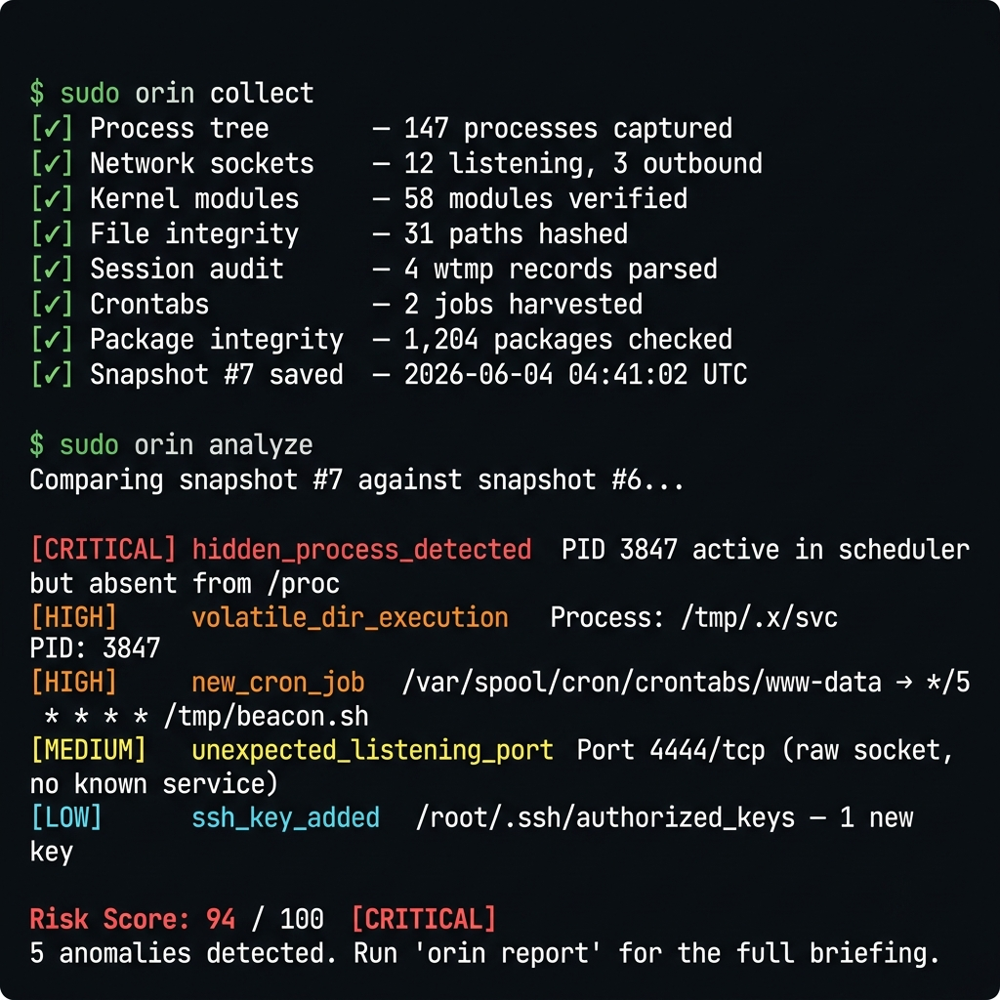
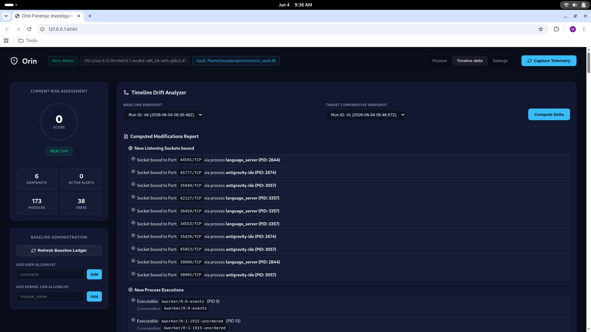
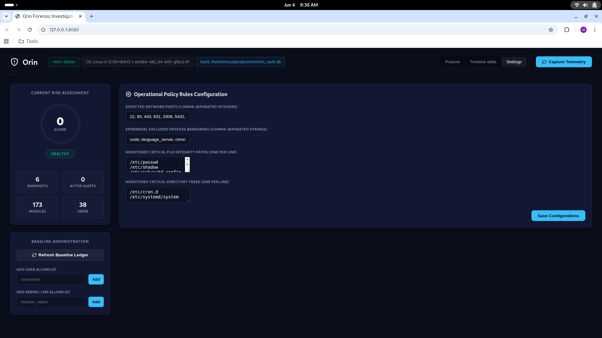

# Orin — Offline Linux Forensics & Integrity Engine

> **Fully offline. Zero dependencies. No agents.**
> Host security scanner and forensic triage tool for Linux — built for analysts who trust nothing but the kernel itself.


<p align="center">
  
</p>

Orin takes point-in-time snapshots of critical OS state, compares them against trusted baselines, identifies anomalous behaviour, and produces tamper-evident evidence bundles — all without any external Python packages or network access.

<p align="center">
  
</p>

```bash
# Install (pipx isolated environment — recommended)
chmod +x install.sh && ./install.sh

# First run
sudo orin init && sudo orin collect && sudo orin analyze && sudo orin report

# Automate collection (runs every 10 minutes via cron — set it and forget it)
sudo orin schedule --install

# Launch the secure local web dashboard
# A one-time access token is printed to the terminal — only root sees it
sudo orin serve
```

---

## Why Orin?

Most Linux security tools require a persistent daemon, a cloud backend, or a pile of third-party packages. That's a liability on hardened, air-gapped, or forensically sensitive systems.

Orin's constraints are its strengths:

| | Orin | Falco | osquery | Wazuh |
|---|---|---|---|---|
| **Runtime dependencies** | psutil | Kernel driver | Large | Agent + server |
| **Network required** | Never | Optional | Optional | Yes |
| **Air-gap safe** | ✅ | ❌ | ❌ | ❌ |
| **Forensic evidence signing** | ✅ HMAC-SHA256 | ❌ | ❌ | ❌ |
| **Reads directly from `/proc`** | ✅ | ✅ | ✅ | ❌ |
| **Anti-forensics detection** | ✅ wtmp/lastlog | ❌ | ❌ | ❌ |

**Orin is built for:** security engineers, forensic analysts, incident responders, and sysadmins who need a portable, dependency-free tool they can drop onto any Linux system and trust immediately.

---

## 🛠️ Implemented Capabilities

| # | Module | Description |
|---|--------|-------------|
| 1 | **Process Tree Harvester** | Reads `/proc/[pid]/stat`, `/comm`, `/exe`, `/cmdline` to build a full PPID-linked process tree. |
| 2 | **Network Socket Auditor** | Parses `/proc/net/{tcp,tcp6,udp,udp6}` for IPv4/IPv6 listening ports and outbound connections. |
| 3 | **Kernel Module Monitor** | Reads `/proc/modules` and validates loaded LKMs against an immutable baseline set at `init`. |
| 4 | **User & SSH Key Inventory** | Harvests `/etc/passwd` and all `~/.ssh/authorized_keys` files for account and key fingerprint tracking. |
| 5 | **File Integrity Monitor (FIM)** | SHA-256 checksums for configured critical paths and directories. Uses a stat-based look-back cache — `os.stat()` metadata (mtime, ctime, size) is compared against the previous snapshot before touching the file. Hashing is skipped entirely for unchanged files. |
| 6 | **Auth Log Parser** | Scans `/var/log/auth.log` for SSH brute-force sources and privilege escalation events. |
| 7 | **In-Memory Executable Recovery** | Resolves `/proc/[pid]/exe` symlinks to detect running processes whose binaries have been deleted from disk, dumps the payload, and logs MD5 & SHA-256 hashes. |
| 8 | **Promiscuous Mode Flag Auditor** | Reads `/sys/class/net/*/flags` and raises alerts when the `IFF_PROMISC` (`0x100`) bit is set. |
| 9 | **Binary Session Auditor** | Parses `/var/log/wtmp` and `/var/log/lastlog` binary structures to track login/logout lifecycles and detect anti-forensic tampering (zeroed records, epoch resets). |
| 10 | **Hidden Process Detector** | Probes scheduler-active PIDs via null signaling (`os.kill(pid, 0)`) and cross-references against `/proc` to expose kernel rootkits. |
| 11 | **Offline Package Integrity Engine** | Verifies on-disk binaries against Debian `/var/lib/dpkg/info/*.md5sums`. Primary pass uses MD5 only; SHA-256 is computed lazily and only on confirmed tamper, eliminating redundant double-hashing on clean binaries. |
| 12 | **Scheduled Task (Crontab) Harvester** | Parses user spool crontabs, `/etc/crontab`, `/etc/cron.d/*`, and timed script directories. Detects cron drift, volatile-path execution, and reverse-shell commands. |
| 13 | **Threat Detection Rules Engine** | Evaluates all collected data against rules for masquerade processes, reverse shells, C2 blocklist hits, SSH persistence, FIM changes, unauthorized accounts, and cron anomalies. Supports per-alert suppression rules and severity overrides. |
| 14 | **Forensic Alert Auto-Resolution** | Automatically closes historical alerts once the anomalous condition is no longer present in subsequent snapshots. |
| 15 | **Cryptographic Evidence Export** | Serialises snapshots to deterministic JSON, signs with HMAC-SHA256, and wraps in a portable `{signature, data}` bundle. |
| 16 | **Markdown & HTML Reporting** | Generates lightweight Markdown briefings and self-contained dark-mode HTML dashboards with tabbed navigation and severity badges. |
| 17 | **Local Web Dashboard (`orin serve`)** | Lightweight stdlib HTTP server serving a single-page forensic console. Features a live risk score gauge, severity-tiered alert feed with triage actions (acknowledge, suppress, annotate), snapshot timeline explorer with inline delta view, collector status cards, and FIM change heatmap. Auto-refreshes every 30 seconds. Zero external dependencies. |
| 18 | **Automated Collection Scheduler (`orin schedule`)** | Installs a system-wide cron job (`/etc/cron.d/orin`) or user-level crontab entry that automatically runs `collect → analyze` on a configurable interval (default: every 10 minutes). Collection and analysis logs stream to syslog via `logger`. Falls back to user-level crontab when not running as root. |
| 19 | **Dashboard Auto-Token Security** | On every `orin serve` start, a cryptographically random 256-bit session token (`secrets.token_hex(32)`) is generated and printed to the terminal as a full access URL. Only the user who ran `sudo orin serve` can see it. All API requests are validated via `hmac.compare_digest()` (timing-safe). The token is injected into the dashboard HTML at serve time — the JS attaches it as a `Bearer` header on every `fetch()`. Accessing the console without the token returns a friendly 401 page. Token is ephemeral — regenerated on every server restart. |

---

## 🛡️ Threat Detection Rules

- **Kernel thread masquerade** — flags processes mimicking kernel workers (`kworker`, `ksoftirqd`, …) with a non-system PPID.
- **Reverse shell detection** — matches dangerous invocation patterns (`python -c`, `bash -i`, `sh -i`).
- **Volatile-directory execution** — processes running from `/tmp`, `/dev/shm`, `/var/tmp`.
- **Known-bad binaries** — `nc`, `ncat`, `netcat`, `socat`, `nmap`, `xmrig`, and more.
- **C2 blocklist** — compares outbound connections against an offline IP blocklist.
- **SSH persistence detection** — new keys appearing between snapshots.
- **File integrity monitoring** — stat-cache accelerated SHA-256 change detection vs. the previous snapshot; unchanged files are skipped without reading from disk.
- **Untrusted kernel modules** — LKMs absent from the baseline captured at `init`.
- **Unauthorized account creation / UID-0 privilege escalation**.
- **In-memory deleted binaries** — monitors virtual symlinks pointing to deleted executables and dumps their payloads to a forensic vault.
- **Promiscuous mode detection** — triggers alerts when a network interface's `IFF_PROMISC` flag is active.
- **Log tampering & anti-forensics** — flags zeroed-out records or epoch timestamp resets in wtmp and lastlog binary log structures.
- **Hidden process scanning** — compares scheduler-active PIDs via null signaling with visible `/proc` listings to detect kernel rootkits.
- **Offline package verification** — flags MD5 mismatches between on-disk binaries and dpkg records; forensic SHA-256 computed only on tampered files.
- **Cron job drift detection** — flags newly added cron scheduled tasks.
- **Cron execution anomalies** — flags cron jobs executing commands from volatile directories or containing reverse shell signatures.
- **Alert suppression & severity override** — analysts can suppress recurring false positives and override alert severity directly from the web dashboard or CLI.
- **Auto-resolution** — automatically resolves historical alerts once the anomalous condition is corrected in a subsequent snapshot.

## 📦 Cryptographic Evidence Export

Snapshots are serialised to canonical JSON (keys sorted for determinism), signed with HMAC-SHA256, and wrapped in a portable `{signature, data}` bundle. A compromised bundle is immediately detected by `orin verify`.

---

## ⚡ Performance & Collection Efficiency

Orin is built to eliminate redundant I/O on every collection run, ensuring maximum efficiency and speed without compromising detection fidelity.

* **Stat-Based FIM Cache (`orin.collectors.integrity`):**
  Before computing any SHA-256 hash, the File Integrity Monitor (FIM) queries file metadata via `os.stat()` and compares `mtime`, `ctime`, and `size` against the most recent snapshot record in the SQLite vault. Files where all three attributes match are short-circuited: the cached hash is reused and the file is never read from disk. A full 64 KB-buffered SHA-256 is computed only when metadata indicates a change. Automatic `ALTER TABLE` migrations are handled dynamically for existing databases.
* **Lazy SHA-256 in Package Integrity (`orin.collectors.pkg_integrity`):**
  The offline package integrity scanner previously computed both MD5 and SHA-256 for every package binary in a single pass. Since Debian's `*.md5sums` records only carry MD5 signatures, computing SHA-256 on every run was pure overhead for clean files. Now, Orin computes MD5 in the primary pass and only lazily computes the forensic SHA-256 when an MD5 mismatch is confirmed, making this a zero-cost operation for clean systems.

---

## 📂 Project Structure

```
orin/
├── orin_config.json          # User configuration (optional)
├── install.sh                # Automated pipx installer
├── setup.py                  # Setuptools packaging (package: orin-engine)
├── src/
│   └── orin/
│       ├── __init__.py
│       ├── main.py           # CLI entry point & subcommand router
│       ├── core/
│       │   ├── config.py     # JSON config loader with safe defaults
│       │   ├── crypto.py     # HMAC-SHA256 sign & verify
│       │   ├── database.py   # SQLite schema (OrinStorage ORM)
│       │   ├── scheduler.py  # Cron automation (orin schedule)
│       │   ├── server.py     # stdlib HTTP server + REST API + auto-token auth (orin serve)
│       │   └── dashboard.html # Single-page forensic console (bundled inline)
│       ├── collectors/
│       │   ├── connections.py      # Listening ports & outbound TCP
│       │   ├── deleted_binaries.py # In-memory payload recovery & hash check
│       │   ├── integrity.py        # SHA-256 FIM with stat-based cache
│       │   ├── kernel.py           # /proc/modules harvester
│       │   ├── logs.py             # auth.log parser
│       │   ├── persistence.py      # SSH authorized_keys inventory
│       │   ├── pkg_integrity.py    # dpkg MD5 verification (lazy SHA-256 on mismatch)
│       │   ├── processes.py        # /proc process tree
│       │   ├── promisc.py          # Promiscuous interface flags auditor
│       │   ├── session_audit.py    # binary log session lifecycle parser (wtmp/lastlog)
│       │   ├── crontabs.py         # scheduled cron tasks parser
│       │   └── users.py            # /etc/passwd harvester
│       └── analysis/
│           ├── engine.py     # Threat detection rules engine
│           ├── diff.py       # Cross-file snapshot comparator
│           ├── timeline.py   # Intra-vault snapshot delta
│           ├── unhide.py     # Hidden process scheduler scanner
│           └── reporter.py   # Markdown & HTML report compilers
└── tests/
    ├── test_crypto.py
    ├── test_database.py
    ├── test_diff.py
    ├── test_engine.py
    ├── test_crontabs.py
    ├── test_scheduler.py
    ├── test_main.py
    └── test_reporter.py
```

---

## 🔧 Installation

> Requires **Python ≥ 3.10**. No third-party packages are needed at runtime.

On modern Linux distributions enforcing **PEP 668** (externally-managed environments), choose one of:

### Method A — Automated installer (recommended)
```bash
chmod +x install.sh
./install.sh
```
The script installs Orin via `pipx` into an isolated virtual environment and makes the `orin` command available system-wide.

### Method B — System-wide (for root forensic workflows)
```bash
sudo pip install . --break-system-packages
```

### Method C — Development mode
```bash
pip install -e .
# or run directly without installing:
PYTHONPATH=src python -m orin.main <subcommand>
```

---

## 📖 Usage

All subcommands that read from privileged files (e.g. `/var/log/auth.log`, `/proc/*/fd/`) produce richer results when run as root.

### Workflow overview

```
init → collect → analyze → report
        ↓
      delta / diff / export / verify / serve / schedule
```

> [!TIP]
> Use `orin schedule --install` to automate the `collect → analyze` cycle via cron so you **never have to call it manually again**.

---

### `orin init`
Creates the SQLite vault and locks two immutable baselines:
- Trusted kernel modules (from the current `/proc/modules`)
- Trusted user accounts (from the current `/etc/passwd`)

```bash
sudo orin init
```

---

### `orin collect`
Harvests a full system state snapshot and persists it to the vault.

```bash
sudo orin collect
```

---

### `orin analyze`
Runs all threat-detection rules against the most recent snapshot and writes findings to the `security_events` table. Prints a severity-tiered risk score (0–100):

- **Critical anomalies present:** Base score `90` (scales up to `100` for multiple critical events).
- **High anomalies present:** Base score `65` (scales up to `89`).
- **Medium anomalies present:** Base score `35` (scales up to `64`).
- **Low anomalies present:** Base score `15` (scales up to `34`).
- **Clean system:** Risk score `0`.

```bash
sudo orin analyze
```

---

### `orin status`
Prints a dashboard summary: snapshot count, kernel baseline size, total security events, and latest snapshot metadata.

```bash
orin status
```

---

### `orin report`
Compiles a forensic audit briefing from the latest snapshot and all unresolved alerts.

```bash
# Markdown (default)
sudo orin report

# Self-contained HTML dashboard
sudo orin report --format html

# Custom output path
sudo orin report --format html --output /tmp/orin_report.html
```

---

### `orin serve`
Starts a local-only forensic web console. Binds to `127.0.0.1:8000` by default (configurable). The dashboard auto-refreshes every 30 seconds and triggers a new `collect` + `analyze` cycle on each refresh. Also accepts manual trigger via the **"Trigger Capture"** button.

```bash
# Default — auto-generates a secure session token
sudo orin serve

# Custom port / host
sudo orin serve --port 9090
sudo orin serve --port 8443 --host 0.0.0.0

# Legacy Basic Auth (alternative to auto-token)
sudo orin serve --username admin --password MyStrongPassword

# Disable auth entirely (trusted private networks only)
sudo orin serve --no-auth
```

#### 🔐 Dashboard Security — Auto-Token (Default)

When `orin serve` starts **without** `--username`/`--password`, it automatically generates a cryptographically random 256-bit session token and prints the full access URL to the terminal:

```
  ================================================================
         ORIN FORENSIC CONSOLE — SECURE ACCESS TOKEN
  ================================================================
  Open this URL in your browser (token refreshes on restart):
  ================================================================
  http://127.0.0.1:8000/?token=a3f9b8c1d2e4f5...
  ================================================================
       Keep this URL private — it grants full console access.
  ================================================================
```

Because only the person running `sudo orin serve` can read the terminal, **only root sees the token**. Any attempt to open the dashboard without the correct token receives a locked-out 401 page. The token is ephemeral — a new one is generated on every restart. All token comparisons use `hmac.compare_digest()` (timing-safe, resistant to timing attacks).

Orin's local web interface simplifies forensic triage for system administrators, security managers, and incident response teams. All data stays local — the web server binds only to `localhost` (`127.0.0.1`) by default.

> [!NOTE]
> `orin serve` starts a local-only HTTP server bound to `127.0.0.1`. No data leaves the machine. TLS and optional basic-auth are available for multi-user environments.

<p align="center">
  
</p>

#### Core Dashboard Features:
* **Live Risk Dashboard:** A lightweight Python HTTP server (stdlib `http.server`) serves a single-page dashboard reading directly from the SQLite vault. Displays a live risk score gauge, severity-tiered alert feed, snapshot history timeline, collector status cards, and FIM change heatmap. Auto-refreshes every 30 seconds via `fetch` polling. Zero external JS dependencies.
* **Interactive Alert Manager:** Each alert card supports one-click acknowledge (marks event as reviewed with timestamp), analyst notes (free-text annotation stored in the vault), false-positive suppression (creates a suppression rule for future occurrences), and severity override. All actions write directly to the local SQLite `security_events` table.
* **Snapshot Timeline Explorer:** A scrollable timeline of all collected snapshots. Clicking a snapshot shows its collector summary cards. Selecting two snapshots triggers an inline delta view equivalent to `orin delta`, highlighting process, port, file, user, and module changes.

<p align="center">
  
</p>

* **Configuration Editor:** A settings page with field-validated forms for: expected ports list, whitelisted processes, FIM critical paths and directories, and severity thresholds. Changes are written back to `orin_config.json` atomically.

---

### `orin delta`
Timeline drift analysis between two snapshot IDs stored in the vault. Automatically uses the two most recent snapshots when `--base` / `--target` are omitted.

```bash
sudo orin delta --base 1 --target 3
```

---

### `orin diff`
Compares **any two files** — live SQLite databases # Orin — Offline Linux Forensics & Integrity Engine

> **Fully offline. Zero dependencies. No agents.**
> Host security scanner and forensic triage tool for Linux — built for analysts who trust nothing but the kernel itself.


<p align="center">
  
</p>

Orin takes point-in-time snapshots of critical OS state, compares them against trusted baselines, identifies anomalous behaviour, and produces tamper-evident evidence bundles — all without any external Python packages or network access.

<p align="center">
  
</p>

```bash
# Install (pipx isolated environment — recommended)
chmod +x install.sh && ./install.sh

# First run
sudo orin init && sudo orin collect && sudo orin analyze && sudo orin report

# Automate collection (runs every 10 minutes via cron — set it and forget it)
sudo orin schedule --install

# Launch the secure local web dashboard
# A one-time access token is printed to the terminal — only root sees it
sudo orin serve
```

---

## Why Orin?

Most Linux security tools require a persistent daemon, a cloud backend, or a pile of third-party packages. That's a liability on hardened, air-gapped, or forensically sensitive systems.

Orin's constraints are its strengths:

| | Orin | Falco | osquery | Wazuh |
|---|---|---|---|---|
| **Runtime dependencies** | None | Kernel driver | Large | Agent + server |
| **Network required** | Never | Optional | Optional | Yes |
| **Air-gap safe** | ✅ | ❌ | ❌ | ❌ |
| **Forensic evidence signing** | ✅ HMAC-SHA256 | ❌ | ❌ | ❌ |
| **Reads directly from `/proc`** | ✅ | ✅ | ✅ | ❌ |
| **Zero install on target** | CLI only | ❌ | ❌ | ❌ |
| **Anti-forensics detection** | ✅ wtmp/lastlog | ❌ | ❌ | ❌ |

**Orin is built for:** security engineers, forensic analysts, incident responders, and sysadmins who need a portable, dependency-free tool they can drop onto any Linux system and trust immediately.

---

## 🛠️ Implemented Capabilities

| # | Module | Description |
|---|--------|-------------|
| 1 | **Process Tree Harvester** | Reads `/proc/[pid]/stat`, `/comm`, `/exe`, `/cmdline` to build a full PPID-linked process tree. |
| 2 | **Network Socket Auditor** | Parses `/proc/net/{tcp,tcp6,udp,udp6}` for IPv4/IPv6 listening ports and outbound connections. |
| 3 | **Kernel Module Monitor** | Reads `/proc/modules` and validates loaded LKMs against an immutable baseline set at `init`. |
| 4 | **User & SSH Key Inventory** | Harvests `/etc/passwd` and all `~/.ssh/authorized_keys` files for account and key fingerprint tracking. |
| 5 | **File Integrity Monitor (FIM)** | SHA-256 checksums for configured critical paths and directories. Uses a stat-based look-back cache — `os.stat()` metadata (mtime, ctime, size) is compared against the previous snapshot before touching the file. Hashing is skipped entirely for unchanged files. |
| 6 | **Auth Log Parser** | Scans `/var/log/auth.log` for SSH brute-force sources and privilege escalation events. |
| 7 | **In-Memory Executable Recovery** | Resolves `/proc/[pid]/exe` symlinks to detect running processes whose binaries have been deleted from disk, dumps the payload, and logs MD5 & SHA-256 hashes. |
| 8 | **Promiscuous Mode Flag Auditor** | Reads `/sys/class/net/*/flags` and raises alerts when the `IFF_PROMISC` (`0x100`) bit is set. |
| 9 | **Binary Session Auditor** | Parses `/var/log/wtmp` and `/var/log/lastlog` binary structures to track login/logout lifecycles and detect anti-forensic tampering (zeroed records, epoch resets). |
| 10 | **Hidden Process Detector** | Probes scheduler-active PIDs via null signaling (`os.kill(pid, 0)`) and cross-references against `/proc` to expose kernel rootkits. |
| 11 | **Offline Package Integrity Engine** | Verifies on-disk binaries against Debian `/var/lib/dpkg/info/*.md5sums`. Primary pass uses MD5 only; SHA-256 is computed lazily and only on confirmed tamper, eliminating redundant double-hashing on clean binaries. |
| 12 | **Scheduled Task (Crontab) Harvester** | Parses user spool crontabs, `/etc/crontab`, `/etc/cron.d/*`, and timed script directories. Detects cron drift, volatile-path execution, and reverse-shell commands. |
| 13 | **Threat Detection Rules Engine** | Evaluates all collected data against rules for masquerade processes, reverse shells, C2 blocklist hits, SSH persistence, FIM changes, unauthorized accounts, and cron anomalies. Supports per-alert suppression rules and severity overrides. |
| 14 | **Forensic Alert Auto-Resolution** | Automatically closes historical alerts once the anomalous condition is no longer present in subsequent snapshots. |
| 15 | **Cryptographic Evidence Export** | Serialises snapshots to deterministic JSON, signs with HMAC-SHA256, and wraps in a portable `{signature, data}` bundle. |
| 16 | **Markdown & HTML Reporting** | Generates lightweight Markdown briefings and self-contained dark-mode HTML dashboards with tabbed navigation and severity badges. |
| 17 | **Local Web Dashboard (`orin serve`)** | Lightweight stdlib HTTP server serving a single-page forensic console. Features a live risk score gauge, severity-tiered alert feed with triage actions (acknowledge, suppress, annotate), snapshot timeline explorer with inline delta view, collector status cards, and FIM change heatmap. Auto-refreshes every 30 seconds. Zero external dependencies. |
| 18 | **Automated Collection Scheduler (`orin schedule`)** | Installs a system-wide cron job (`/etc/cron.d/orin`) or user-level crontab entry that automatically runs `collect → analyze` on a configurable interval (default: every 10 minutes). Collection and analysis logs stream to syslog via `logger`. Falls back to user-level crontab when not running as root. |
| 19 | **Dashboard Auto-Token Security** | On every `orin serve` start, a cryptographically random 256-bit session token (`secrets.token_hex(32)`) is generated and printed to the terminal as a full access URL. Only the user who ran `sudo orin serve` can see it. All API requests are validated via `hmac.compare_digest()` (timing-safe). The token is injected into the dashboard HTML at serve time — the JS attaches it as a `Bearer` header on every `fetch()`. Accessing the console without the token returns a friendly 401 page. Token is ephemeral — regenerated on every server restart. |

---

## 🛡️ Threat Detection Rules

- **Kernel thread masquerade** — flags processes mimicking kernel workers (`kworker`, `ksoftirqd`, …) with a non-system PPID.
- **Reverse shell detection** — matches dangerous invocation patterns (`python -c`, `bash -i`, `sh -i`).
- **Volatile-directory execution** — processes running from `/tmp`, `/dev/shm`, `/var/tmp`.
- **Known-bad binaries** — `nc`, `ncat`, `netcat`, `socat`, `nmap`, `xmrig`, and more.
- **C2 blocklist** — compares outbound connections against an offline IP blocklist.
- **SSH persistence detection** — new keys appearing between snapshots.
- **File integrity monitoring** — stat-cache accelerated SHA-256 change detection vs. the previous snapshot; unchanged files are skipped without reading from disk.
- **Untrusted kernel modules** — LKMs absent from the baseline captured at `init`.
- **Unauthorized account creation / UID-0 privilege escalation**.
- **In-memory deleted binaries** — monitors virtual symlinks pointing to deleted executables and dumps their payloads to a forensic vault.
- **Promiscuous mode detection** — triggers alerts when a network interface's `IFF_PROMISC` flag is active.
- **Log tampering & anti-forensics** — flags zeroed-out records or epoch timestamp resets in wtmp and lastlog binary log structures.
- **Hidden process scanning** — compares scheduler-active PIDs via null signaling with visible `/proc` listings to detect kernel rootkits.
- **Offline package verification** — flags MD5 mismatches between on-disk binaries and dpkg records; forensic SHA-256 computed only on tampered files.
- **Cron job drift detection** — flags newly added cron scheduled tasks.
- **Cron execution anomalies** — flags cron jobs executing commands from volatile directories or containing reverse shell signatures.
- **Alert suppression & severity override** — analysts can suppress recurring false positives and override alert severity directly from the web dashboard or CLI.
- **Auto-resolution** — automatically resolves historical alerts once the anomalous condition is corrected in a subsequent snapshot.

## 📦 Cryptographic Evidence Export

Snapshots are serialised to canonical JSON (keys sorted for determinism), signed with HMAC-SHA256, and wrapped in a portable `{signature, data}` bundle. A compromised bundle is immediately detected by `orin verify`.

---

## ⚡ Performance & Collection Efficiency

Orin is built to eliminate redundant I/O on every collection run, ensuring maximum efficiency and speed without compromising detection fidelity.

* **Stat-Based FIM Cache (`orin.collectors.integrity`):**
  Before computing any SHA-256 hash, the File Integrity Monitor (FIM) queries file metadata via `os.stat()` and compares `mtime`, `ctime`, and `size` against the most recent snapshot record in the SQLite vault. Files where all three attributes match are short-circuited: the cached hash is reused and the file is never read from disk. A full 64 KB-buffered SHA-256 is computed only when metadata indicates a change. Automatic `ALTER TABLE` migrations are handled dynamically for existing databases.
* **Lazy SHA-256 in Package Integrity (`orin.collectors.pkg_integrity`):**
  The offline package integrity scanner previously computed both MD5 and SHA-256 for every package binary in a single pass. Since Debian's `*.md5sums` records only carry MD5 signatures, computing SHA-256 on every run was pure overhead for clean files. Now, Orin computes MD5 in the primary pass and only lazily computes the forensic SHA-256 when an MD5 mismatch is confirmed, making this a zero-cost operation for clean systems.

---

## 📂 Project Structure

```
orin/
├── orin_config.json          # User configuration (optional)
├── install.sh                # Automated pipx installer
├── setup.py                  # Setuptools packaging (package: orin-engine)
├── src/
│   └── orin/
│       ├── __init__.py
│       ├── main.py           # CLI entry point & subcommand router
│       ├── core/
│       │   ├── config.py     # JSON config loader with safe defaults
│       │   ├── crypto.py     # HMAC-SHA256 sign & verify
│       │   ├── database.py   # SQLite schema (OrinStorage ORM)
│       │   ├── scheduler.py  # Cron automation (orin schedule)
│       │   ├── server.py     # stdlib HTTP server + REST API + auto-token auth (orin serve)
│       │   └── dashboard.html # Single-page forensic console (bundled inline)
│       ├── collectors/
│       │   ├── connections.py      # Listening ports & outbound TCP
│       │   ├── deleted_binaries.py # In-memory payload recovery & hash check
│       │   ├── integrity.py        # SHA-256 FIM with stat-based cache
│       │   ├── kernel.py           # /proc/modules harvester
│       │   ├── logs.py             # auth.log parser
│       │   ├── persistence.py      # SSH authorized_keys inventory
│       │   ├── pkg_integrity.py    # dpkg MD5 verification (lazy SHA-256 on mismatch)
│       │   ├── processes.py        # /proc process tree
│       │   ├── promisc.py          # Promiscuous interface flags auditor
│       │   ├── session_audit.py    # binary log session lifecycle parser (wtmp/lastlog)
│       │   ├── crontabs.py         # scheduled cron tasks parser
│       │   └── users.py            # /etc/passwd harvester
│       └── analysis/
│           ├── engine.py     # Threat detection rules engine
│           ├── diff.py       # Cross-file snapshot comparator
│           ├── timeline.py   # Intra-vault snapshot delta
│           ├── unhide.py     # Hidden process scheduler scanner
│           └── reporter.py   # Markdown & HTML report compilers
└── tests/
    ├── test_crypto.py
    ├── test_database.py
    ├── test_diff.py
    ├── test_engine.py
    ├── test_crontabs.py
    ├── test_scheduler.py
    ├── test_main.py
    └── test_reporter.py
```

---

## 🔧 Installation

> Requires **Python ≥ 3.10**. No third-party packages are needed at runtime.

On modern Linux distributions enforcing **PEP 668** (externally-managed environments), choose one of:

### Method A — Automated installer (recommended)
```bash
chmod +x install.sh
./install.sh
```
The script installs Orin via `pipx` into an isolated virtual environment and makes the `orin` command available system-wide.

### Method B — System-wide (for root forensic workflows)
```bash
sudo pip install . --break-system-packages
```

### Method C — Development mode
```bash
pip install -e .
# or run directly without installing:
PYTHONPATH=src python -m orin.main <subcommand>
```

---

## 📖 Usage

All subcommands that read from privileged files (e.g. `/var/log/auth.log`, `/proc/*/fd/`) produce richer results when run as root.

### Workflow overview

```
init → collect → analyze → report
        ↓
      delta / diff / export / verify / serve / schedule
```

> [!TIP]
> Use `orin schedule --install` to automate the `collect → analyze` cycle via cron so you **never have to call it manually again**.

---

### `orin init`
Creates the SQLite vault and locks two immutable baselines:
- Trusted kernel modules (from the current `/proc/modules`)
- Trusted user accounts (from the current `/etc/passwd`)

```bash
sudo orin init
```

---

### `orin collect`
Harvests a full system state snapshot and persists it to the vault.

```bash
sudo orin collect
```

---

### `orin analyze`
Runs all threat-detection rules against the most recent snapshot and writes findings to the `security_events` table. Prints a severity-tiered risk score (0–100):

- **Critical anomalies present:** Base score `90` (scales up to `100` for multiple critical events).
- **High anomalies present:** Base score `65` (scales up to `89`).
- **Medium anomalies present:** Base score `35` (scales up to `64`).
- **Low anomalies present:** Base score `15` (scales up to `34`).
- **Clean system:** Risk score `0`.

```bash
sudo orin analyze
```

---

### `orin status`
Prints a dashboard summary: snapshot count, kernel baseline size, total security events, and latest snapshot metadata.

```bash
orin status
```

---

### `orin report`
Compiles a forensic audit briefing from the latest snapshot and all unresolved alerts.

```bash
# Markdown (default)
sudo orin report

# Self-contained HTML dashboard
sudo orin report --format html

# Custom output path
sudo orin report --format html --output /tmp/orin_report.html
```

---

### `orin serve`
Starts a local-only forensic web console. Binds to `127.0.0.1:8000` by default (configurable). The dashboard auto-refreshes every 30 seconds and triggers a new `collect` + `analyze` cycle on each refresh. Also accepts manual trigger via the **"Trigger Capture"** button.

```bash
# Default — auto-generates a secure session token
sudo orin serve

# Custom port / host
sudo orin serve --port 9090
sudo orin serve --port 8443 --host 0.0.0.0

# Legacy Basic Auth (alternative to auto-token)
sudo orin serve --username admin --password MyStrongPassword

# Disable auth entirely (trusted private networks only)
sudo orin serve --no-auth
```

#### 🔐 Dashboard Security — Auto-Token (Default)

When `orin serve` starts **without** `--username`/`--password`, it automatically generates a cryptographically random 256-bit session token and prints the full access URL to the terminal:

```
  ================================================================
         ORIN FORENSIC CONSOLE — SECURE ACCESS TOKEN
  ================================================================
  Open this URL in your browser (token refreshes on restart):
  ================================================================
  http://127.0.0.1:8000/?token=a3f9b8c1d2e4f5...
  ================================================================
       Keep this URL private — it grants full console access.
  ================================================================
```

Because only the person running `sudo orin serve` can read the terminal, **only root sees the token**. Any attempt to open the dashboard without the correct token receives a locked-out 401 page. The token is ephemeral — a new one is generated on every restart. All token comparisons use `hmac.compare_digest()` (timing-safe, resistant to timing attacks).

Orin's local web interface simplifies forensic triage for system administrators, security managers, and incident response teams. All data stays local — the web server binds only to `localhost` (`127.0.0.1`) by default.

> [!NOTE]
> `orin serve` starts a local-only HTTP server bound to `127.0.0.1`. No data leaves the machine. TLS and optional basic-auth are available for multi-user environments.

<p align="center">
  
</p>

#### Core Dashboard Features:
* **Live Risk Dashboard:** A lightweight Python HTTP server (stdlib `http.server`) serves a single-page dashboard reading directly from the SQLite vault. Displays a live risk score gauge, severity-tiered alert feed, snapshot history timeline, collector status cards, and FIM change heatmap. Auto-refreshes every 30 seconds via `fetch` polling. Zero external JS dependencies.
* **Interactive Alert Manager:** Each alert card supports one-click acknowledge (marks event as reviewed with timestamp), analyst notes (free-text annotation stored in the vault), false-positive suppression (creates a suppression rule for future occurrences), and severity override. All actions write directly to the local SQLite `security_events` table.
* **Snapshot Timeline Explorer:** A scrollable timeline of all collected snapshots. Clicking a snapshot shows its collector summary cards. Selecting two snapshots triggers an inline delta view equivalent to `orin delta`, highlighting process, port, file, user, and module changes.

<p align="center">
  
</p>

* **Configuration Editor:** A settings page with field-validated forms for: expected ports list, whitelisted processes, FIM critical paths and directories, and severity thresholds. Changes are written back to `orin_config.json` atomically.

---

### `orin delta`
Timeline drift analysis between two snapshot IDs stored in the vault. Automatically uses the two most recent snapshots when `--base` / `--target` are omitted.

```bash
sudo orin delta --base 1 --target 3
```

---

### `orin diff`
Compares **any two files** — live SQLite databases or signed JSON exports — and produces a structured drift report. Useful for comparing snapshots from different machines.

```bash
# Compare two vault files
orin diff /backups/orin_day1.db /var/lib/orin/orin_vault.db

# Compare two signed exports (passphrase required)
orin diff baseline.json current.json --secret "YourPassphrase"
```

---

### `orin export`
Serialises a snapshot into a portable, HMAC-signed JSON bundle.

```bash
sudo orin export --snapshot 2 --secret "YourSecurePassphrase"
# Writes: orin_export_snap_2.json
```

---

### `orin verify`
Verifies the integrity of a signed export. Fails loudly if the file has been tampered with.

```bash
orin verify --file orin_export_snap_2.json --s# Orin — Offline Linux Forensics & Integrity Engine

> **Fully offline. Zero dependencies. No agents.**
> Host security scanner and forensic triage tool for Linux — built for analysts who trust nothing but the kernel itself.


<p align="center">
  
</p>

Orin takes point-in-time snapshots of critical OS state, compares them against trusted baselines, identifies anomalous behaviour, and produces tamper-evident evidence bundles — all without any external Python packages or network access.

<p align="center">
  
</p>

```bash
# Install (pipx isolated environment — recommended)
chmod +x install.sh && ./install.sh

# First run
sudo orin init && sudo orin collect && sudo orin analyze && sudo orin report

# Automate collection (runs every 10 minutes via cron — set it and forget it)
sudo orin schedule --install

# Launch the secure local web dashboard
# A one-time access token is printed to the terminal — only root sees it
sudo orin serve
```

---

## Why Orin?

Most Linux security tools require a persistent daemon, a cloud backend, or a pile of third-party packages. That's a liability on hardened, air-gapped, or forensically sensitive systems.

Orin's constraints are its strengths:

| | Orin | Falco | osquery | Wazuh |
|---|---|---|---|---|
| **Runtime dependencies** | None | Kernel driver | Large | Agent + server |
| **Network required** | Never | Optional | Optional | Yes |
| **Air-gap safe** | ✅ | ❌ | ❌ | ❌ |
| **Forensic evidence signing** | ✅ HMAC-SHA256 | ❌ | ❌ | ❌ |
| **Reads directly from `/proc`** | ✅ | ✅ | ✅ | ❌ |
| **Zero install on target** | CLI only | ❌ | ❌ | ❌ |
| **Anti-forensics detection** | ✅ wtmp/lastlog | ❌ | ❌ | ❌ |

**Orin is built for:** security engineers, forensic analysts, incident responders, and sysadmins who need a portable, dependency-free tool they can drop onto any Linux system and trust immediately.

---

## 🛠️ Implemented Capabilities

| # | Module | Description |
|---|--------|-------------|
| 1 | **Process Tree Harvester** | Reads `/proc/[pid]/stat`, `/comm`, `/exe`, `/cmdline` to build a full PPID-linked process tree. |
| 2 | **Network Socket Auditor** | Parses `/proc/net/{tcp,tcp6,udp,udp6}` for IPv4/IPv6 listening ports and outbound connections. |
| 3 | **Kernel Module Monitor** | Reads `/proc/modules` and validates loaded LKMs against an immutable baseline set at `init`. |
| 4 | **User & SSH Key Inventory** | Harvests `/etc/passwd` and all `~/.ssh/authorized_keys` files for account and key fingerprint tracking. |
| 5 | **File Integrity Monitor (FIM)** | SHA-256 checksums for configured critical paths and directories. Uses a stat-based look-back cache — `os.stat()` metadata (mtime, ctime, size) is compared against the previous snapshot before touching the file. Hashing is skipped entirely for unchanged files. |
| 6 | **Auth Log Parser** | Scans `/var/log/auth.log` for SSH brute-force sources and privilege escalation events. |
| 7 | **In-Memory Executable Recovery** | Resolves `/proc/[pid]/exe` symlinks to detect running processes whose binaries have been deleted from disk, dumps the payload, and logs MD5 & SHA-256 hashes. |
| 8 | **Promiscuous Mode Flag Auditor** | Reads `/sys/class/net/*/flags` and raises alerts when the `IFF_PROMISC` (`0x100`) bit is set. |
| 9 | **Binary Session Auditor** | Parses `/var/log/wtmp` and `/var/log/lastlog` binary structures to track login/logout lifecycles and detect anti-forensic tampering (zeroed records, epoch resets). |
| 10 | **Hidden Process Detector** | Probes scheduler-active PIDs via null signaling (`os.kill(pid, 0)`) and cross-references against `/proc` to expose kernel rootkits. |
| 11 | **Offline Package Integrity Engine** | Verifies on-disk binaries against Debian `/var/lib/dpkg/info/*.md5sums`. Primary pass uses MD5 only; SHA-256 is computed lazily and only on confirmed tamper, eliminating redundant double-hashing on clean binaries. |
| 12 | **Scheduled Task (Crontab) Harvester** | Parses user spool crontabs, `/etc/crontab`, `/etc/cron.d/*`, and timed script directories. Detects cron drift, volatile-path execution, and reverse-shell commands. |
| 13 | **Threat Detection Rules Engine** | Evaluates all collected data against rules for masquerade processes, reverse shells, C2 blocklist hits, SSH persistence, FIM changes, unauthorized accounts, and cron anomalies. Supports per-alert suppression rules and severity overrides. |
| 14 | **Forensic Alert Auto-Resolution** | Automatically closes historical alerts once the anomalous condition is no longer present in subsequent snapshots. |
| 15 | **Cryptographic Evidence Export** | Serialises snapshots to deterministic JSON, signs with HMAC-SHA256, and wraps in a portable `{signature, data}` bundle. |
| 16 | **Markdown & HTML Reporting** | Generates lightweight Markdown briefings and self-contained dark-mode HTML dashboards with tabbed navigation and severity badges. |
| 17 | **Local Web Dashboard (`orin serve`)** | Lightweight stdlib HTTP server serving a single-page forensic console. Features a live risk score gauge, severity-tiered alert feed with triage actions (acknowledge, suppress, annotate), snapshot timeline explorer with inline delta view, collector status cards, and FIM change heatmap. Auto-refreshes every 30 seconds. Zero external dependencies. |
| 18 | **Automated Collection Scheduler (`orin schedule`)** | Installs a system-wide cron job (`/etc/cron.d/orin`) or user-level crontab entry that automatically runs `collect → analyze` on a configurable interval (default: every 10 minutes). Collection and analysis logs stream to syslog via `logger`. Falls back to user-level crontab when not running as root. |
| 19 | **Dashboard Auto-Token Security** | On every `orin serve` start, a cryptographically random 256-bit session token (`secrets.token_hex(32)`) is generated and printed to the terminal as a full access URL. Only the user who ran `sudo orin serve` can see it. All API requests are validated via `hmac.compare_digest()` (timing-safe). The token is injected into the dashboard HTML at serve time — the JS attaches it as a `Bearer` header on every `fetch()`. Accessing the console without the token returns a friendly 401 page. Token is ephemeral — regenerated on every server restart. |

---

## 🛡️ Threat Detection Rules

- **Kernel thread masquerade** — flags processes mimicking kernel workers (`kworker`, `ksoftirqd`, …) with a non-system PPID.
- **Reverse shell detection** — matches dangerous invocation patterns (`python -c`, `bash -i`, `sh -i`).
- **Volatile-directory execution** — processes running from `/tmp`, `/dev/shm`, `/var/tmp`.
- **Known-bad binaries** — `nc`, `ncat`, `netcat`, `socat`, `nmap`, `xmrig`, and more.
- **C2 blocklist** — compares outbound connections against an offline IP blocklist.
- **SSH persistence detection** — new keys appearing between snapshots.
- **File integrity monitoring** — stat-cache accelerated SHA-256 change detection vs. the previous snapshot; unchanged files are skipped without reading from disk.
- **Untrusted kernel modules** — LKMs absent from the baseline captured at `init`.
- **Unauthorized account creation / UID-0 privilege escalation**.
- **In-memory deleted binaries** — monitors virtual symlinks pointing to deleted executables and dumps their payloads to a forensic vault.
- **Promiscuous mode detection** — triggers alerts when a network interface's `IFF_PROMISC` flag is active.
- **Log tampering & anti-forensics** — flags zeroed-out records or epoch timestamp resets in wtmp and lastlog binary log structures.
- **Hidden process scanning** — compares scheduler-active PIDs via null signaling with visible `/proc` listings to detect kernel rootkits.
- **Offline package verification** — flags MD5 mismatches between on-disk binaries and dpkg records; forensic SHA-256 computed only on tampered files.
- **Cron job drift detection** — flags newly added cron scheduled tasks.
- **Cron execution anomalies** — flags cron jobs executing commands from volatile directories or containing reverse shell signatures.
- **Alert suppression & severity override** — analysts can suppress recurring false positives and override alert severity directly from the web dashboard or CLI.
- **Auto-resolution** — automatically resolves historical alerts once the anomalous condition is corrected in a subsequent snapshot.

## 📦 Cryptographic Evidence Export

Snapshots are serialised to canonical JSON (keys sorted for determinism), signed with HMAC-SHA256, and wrapped in a portable `{signature, data}` bundle. A compromised bundle is immediately detected by `orin verify`.

---

## ⚡ Performance & Collection Efficiency

Orin is built to eliminate redundant I/O on every collection run, ensuring maximum efficiency and speed without compromising detection fidelity.

* **Stat-Based FIM Cache (`orin.collectors.integrity`):**
  Before computing any SHA-256 hash, the File Integrity Monitor (FIM) queries file metadata via `os.stat()` and compares `mtime`, `ctime`, and `size` against the most recent snapshot record in the SQLite vault. Files where all three attributes match are short-circuited: the cached hash is reused and the file is never read from disk. A full 64 KB-buffered SHA-256 is computed only when metadata indicates a change. Automatic `ALTER TABLE` migrations are handled dynamically for existing databases.
* **Lazy SHA-256 in Package Integrity (`orin.collectors.pkg_integrity`):**
  The offline package integrity scanner previously computed both MD5 and SHA-256 for every package binary in a single pass. Since Debian's `*.md5sums` records only carry MD5 signatures, computing SHA-256 on every run was pure overhead for clean files. Now, Orin computes MD5 in the primary pass and only lazily computes the forensic SHA-256 when an MD5 mismatch is confirmed, making this a zero-cost operation for clean systems.

---

## 📂 Project Structure

```
orin/
├── orin_config.json          # User configuration (optional)
├── install.sh                # Automated pipx installer
├── setup.py                  # Setuptools packaging (package: orin-engine)
├── src/
│   └── orin/
│       ├── __init__.py
│       ├── main.py           # CLI entry point & subcommand router
│       ├── core/
│       │   ├── config.py     # JSON config loader with safe defaults
│       │   ├── crypto.py     # HMAC-SHA256 sign & verify
│       │   ├── database.py   # SQLite schema (OrinStorage ORM)
│       │   ├── scheduler.py  # Cron automation (orin schedule)
│       │   ├── server.py     # stdlib HTTP server + REST API + auto-token auth (orin serve)
│       │   └── dashboard.html # Single-page forensic console (bundled inline)
│       ├── collectors/
│       │   ├── connections.py      # Listening ports & outbound TCP
│       │   ├── deleted_binaries.py # In-memory payload recovery & hash check
│       │   ├── integrity.py        # SHA-256 FIM with stat-based cache
│       │   ├── kernel.py           # /proc/modules harvester
│       │   ├── logs.py             # auth.log parser
│       │   ├── persistence.py      # SSH authorized_keys inventory
│       │   ├── pkg_integrity.py    # dpkg MD5 verification (lazy SHA-256 on mismatch)
│       │   ├── processes.py        # /proc process tree
│       │   ├── promisc.py          # Promiscuous interface flags auditor
│       │   ├── session_audit.py    # binary log session lifecycle parser (wtmp/lastlog)
│       │   ├── crontabs.py         # scheduled cron tasks parser
│       │   └── users.py            # /etc/passwd harvester
│       └── analysis/
│           ├── engine.py     # Threat detection rules engine
│           ├── diff.py       # Cross-file snapshot comparator
│           ├── timeline.py   # Intra-vault snapshot delta
│           ├── unhide.py     # Hidden process scheduler scanner
│           └── reporter.py   # Markdown & HTML report compilers
└── tests/
    ├── test_crypto.py
    ├── test_database.py
    ├── test_diff.py
    ├── test_engine.py
    ├── test_crontabs.py
    ├── test_scheduler.py
    ├── test_main.py
    └── test_reporter.py
```

---

## 🔧 Installation

> Requires **Python ≥ 3.10**. No third-party packages are needed at runtime.

On modern Linux distributions enforcing **PEP 668** (externally-managed environments), choose one of:

### Method A — Automated installer (recommended)
```bash
chmod +x install.sh
./install.sh
```
The script installs Orin via `pipx` into an isolated virtual environment and makes the `orin` command available system-wide.

### Method B — System-wide (for root forensic workflows)
```bash
sudo pip install . --break-system-packages
```

### Method C — Development mode
```bash
pip install -e .
# or run directly without installing:
PYTHONPATH=src python -m orin.main <subcommand>
```

---

## 📖 Usage

All subcommands that read from privileged files (e.g. `/var/log/auth.log`, `/proc/*/fd/`) produce richer results when run as root.

### Workflow overview

```
init → collect → analyze → report
        ↓
      delta / diff / export / verify / serve / schedule
```

> [!TIP]
> Use `orin schedule --install` to automate the `collect → analyze` cycle via cron so you **never have to call it manually again**.

---

### `orin init`
Creates the SQLite vault and locks two immutable baselines:
- Trusted kernel modules (from the current `/proc/modules`)
- Trusted user accounts (from the current `/etc/passwd`)

```bash
sudo orin init
```

---

### `orin collect`
Harvests a full system state snapshot and persists it to the vault.

```bash
sudo orin collect
```

---

### `orin analyze`
Runs all threat-detection rules against the most recent snapshot and writes findings to the `security_events` table. Prints a severity-tiered risk score (0–100):

- **Critical anomalies present:** Base score `90` (scales up to `100` for multiple critical events).
- **High anomalies present:** Base score `65` (scales up to `89`).
- **Medium anomalies present:** Base score `35` (scales up to `64`).
- **Low anomalies present:** Base score `15` (scales up to `34`).
- **Clean system:** Risk score `0`.

```bash
sudo orin analyze
```

---

### `orin status`
Prints a dashboard summary: snapshot count, kernel baseline size, total security events, and latest snapshot metadata.

```bash
orin status
```

---

### `orin report`
Compiles a forensic audit briefing from the latest snapshot and all unresolved alerts.

```bash
# Markdown (default)
sudo orin report

# Self-contained HTML dashboard
sudo orin report --format html

# Custom output path
sudo orin report --format html --output /tmp/orin_report.html
```

---

### `orin serve`
Starts a local-only forensic web console. Binds to `127.0.0.1:8000` by default (configurable). The dashboard auto-refreshes every 30 seconds and triggers a new `collect` + `analyze` cycle on each refresh. Also accepts manual trigger via the **"Trigger Capture"** button.

```bash
# Default — auto-generates a secure session token
sudo orin serve

# Custom port / host
sudo orin serve --port 9090
sudo orin serve --port 8443 --host 0.0.0.0

# Legacy Basic Auth (alternative to auto-token)
sudo orin serve --username admin --password MyStrongPassword

# Disable auth entirely (trusted private networks only)
sudo orin serve --no-auth
```

#### 🔐 Dashboard Security — Auto-Token (Default)

When `orin serve` starts **without** `--username`/`--password`, it automatically generates a cryptographically random 256-bit session token and prints the full access URL to the terminal:

```
  ================================================================
         ORIN FORENSIC CONSOLE — SECURE ACCESS TOKEN
  ================================================================
  Open this URL in your browser (token refreshes on restart):
  ================================================================
  http://127.0.0.1:8000/?token=a3f9b8c1d2e4f5...
  ================================================================
       Keep this URL private — it grants full console access.
  ================================================================
```

Because only the person running `sudo orin serve` can read the terminal, **only root sees the token**. Any attempt to open the dashboard without the correct token receives a locked-out 401 page. The token is ephemeral — a new one is generated on every restart. All token comparisons use `hmac.compare_digest()` (timing-safe, resistant to timing attacks).

Orin's local web interface simplifies forensic triage for system administrators, security managers, and incident response teams. All data stays local — the web server binds only to `localhost` (`127.0.0.1`) by default.

> [!NOTE]
> `orin serve` starts a local-only HTTP server bound to `127.0.0.1`. No data leaves the machine. TLS and optional basic-auth are available for multi-user environments.

<p align="center">
  
</p>

#### Core Dashboard Features:
* **Live Risk Dashboard:** A lightweight Python HTTP server (stdlib `http.server`) serves a single-page dashboard reading directly from the SQLite vault. Displays a live risk score gauge, severity-tiered alert feed, snapshot history timeline, collector status cards, and FIM change heatmap. Auto-refreshes every 30 seconds via `fetch` polling. Zero external JS dependencies.
* **Interactive Alert Manager:** Each alert card supports one-click acknowledge (marks event as reviewed with timestamp), analyst notes (free-text annotation stored in the vault), false-positive suppression (creates a suppression rule for future occurrences), and severity override. All actions write directly to the local SQLite `security_events` table.
* **Snapshot Timeline Explorer:** A scrollable timeline of all collected snapshots. Clicking a snapshot shows its collector summary cards. Selecting two snapshots triggers an inline delta view equivalent to `orin delta`, highlighting process, port, file, user, and module changes.

<p align="center">
  
</p>

* **Configuration Editor:** A settings page with field-validated forms for: expected ports list, whitelisted processes, FIM critical paths and directories, and severity thresholds. Changes are written back to `orin_config.json` atomically.

---

### `orin delta`
Timeline drift analysis between two snapshot IDs stored in the vault. Automatically uses the two most recent snapshots when `--base` / `--target` are omitted.

```bash
sudo orin delta --base 1 --target 3
```

---

### `orin diff`
Compares **any two files** — live SQLite databases or signed JSON exports — and produces a structured drift report. Useful for comparing snapshots from different machines.

```bash
# Compare two vault files
orin diff /backups/orin_day1.db /var/lib/orin/orin_vault.db

# Compare two signed exports (passphrase required)
orin diff baseline.json current.json --secret "YourPassphrase"
```

---

### `orin export`
Serialises a snapshot into a portable, HMAC-signed JSON bundle.

```bash
sudo orin export --snapshot 2 --secret "YourSecurePassphrase"
# Writes: orin_export_snap_2.json
```

---

### `orin verify`
Verifies the integrity of a signed export. Fails loudly if the file has been tampered with.

```bash
orin verify --file orin_export_snap_2.json --secret "YourSecurePassphrase"
```

---

### `orin schedule`
Manages the automated `collect → analyze` cron schedule so collection runs continuously in the background — **no manual intervention required**.

```bash
# Install: auto-run every 10 minutes (default)
sudo orin schedule --install

# Install with a custom interval (e.g. every 5 minutes)
sudo orin schedule --install --interval 5

# Check current schedule status
orin schedule --status

# Remove the automation schedule
sudo orin schedule --remove
```

> [!NOTE]
> When running as **root**, the schedule is installed as a system-wide cron job at `/etc/cron.d/orin`. When run as a regular user it falls back to the user-level crontab. All collection logs are forwarded to syslog and can be viewed with `journalctl -t orin-collect`.

---

## ⚙️ Configuration

Orin searches for `orin_config.json` in the following order:
1. `./orin_config.json` (working directory)
2. `/etc/orin/orin_config.json` (system-wide)

If neither is found, built-in defaults are used.

```json
{
  "expected_ports": [22, 80, 443, 631, 3306, 5432, 6379, 8080, 8443],
  "whitelisted_processes": ["code", "chrome", "language_server"],
  "critical_paths": [
    "/etc/passwd",
    "/etc/shadow",
    "/etc/ssh/sshd_config",
    "/etc/sudoers",
    "/etc/crontab"
  ],
  "critical_dirs": [
    "/etc/cron.d",
    "/etc/systemd/system"
  ]
}
```

| Key | Purpose |
|-----|---------|
| `expected_ports` | Ports **not** flagged as unexpected listening sockets |
| `whitelisted_processes` | Process names whose ephemeral ports are excluded from alerts |
| `critical_paths` | Individual files monitored by the FIM |
| `critical_dirs` | Directories recursively scanned by the FIM |

---

## 🧪 Running Tests

Orin's test suite uses Python's built-in `unittest` framework — no test dependencies required.

```bash
PYTHONPATH=src python3 -m unittest discover -s tests -v
```

| Test file | Coverage area |
|-----------|--------------|
| `test_database.py` | Schema creation, `OrinStorage` connection management, stat-cache column migration |
| `test_crypto.py` | HMAC sign/verify, passphrase validation, tamper detection |
| `test_connections.py` | IPv4 & IPv6 socket parsing, mock proc net file scanning |
| `test_engine.py` | Analysis rules, event deduplication, tiered risk scoring, cron rule evaluation, suppression/override logic, and alert auto-resolution |
| `test_diff.py` | Snapshot comparator, added/removed/modified detection, and crontabs drift comparison |
| `test_reporter.py` | Markdown and HTML report generation, including crontabs tab rendering |
| `test_server.py` | HTTP server routing, API endpoints, Bearer token auth, schedule API, and DB interaction |
| `test_scheduler.py` | Cron install/remove logic, system vs. user fallback, interval parsing |
| `test_main.py` | CLI subcommand routing, argument parsing, and `cmd_serve` flag validation |
| `test_unhide.py` | Out-of-band hidden process scheduler detector verification |
| `test_deleted_binaries.py` | In-memory deleted executable recovery and payload dumping verification |
| `test_promisc.py` | Promiscuous mode interface flags auditing verification |
| `test_session_audit.py` | Binary wtmp/lastlog session audit parsing verification |
| `test_pkg_integrity.py` | MD5 mismatch detection, lazy SHA-256 on tamper (asserts SHA-256 is never called on clean files), missing-binary reporting |
| `test_crontabs.py` | Cron line parser edge cases, environment variable skipping, system/user crontab directory parsing |

---

## 🗄️ Database Schema

The vault is a single SQLite file (default: `/var/lib/orin/orin_vault.db`) with the following tables:

```
system_snapshots               — one row per orin collect run
collected_processes            — process list per snapshot
collected_ports                — listening sockets per snapshot
collected_outbound_connections — outbound TCP sessions per snapshot
collected_kernel_modules       — loaded LKMs per snapshot
collected_ssh_keys             — authorized_keys inventory per snapshot
collected_file_hashes          — SHA-256 FIM records per snapshot (+ mtime, ctime, size for stat-cache)
collected_users                — /etc/passwd accounts per snapshot
collected_deleted_binaries     — unlinked process image dump records per snapshot
collected_promisc_interfaces   — promiscuous network mode flags per snapshot
collected_wtmp_sessions        — parsed binary logins/logouts per snapshot
collected_lastlog_records      — parsed binary lastlogin timestamps per snapshot
collected_pkg_integrity        — dpkg signature mismatch/missing records per snapshot
collected_crontabs             — user, system-wide, and timed directory cron job records per snapshot
security_events                — persistent, deduplicated alert ledger (+ notes, suppressed, reviewed_at)
baseline_kernel_modules        — trusted LKM allowlist (set at init)
baseline_users                 — trusted account allowlist (set at init)
```

---

## 🗺️ Roadmap

See [ROADMAP.md](ROADMAP.md) for the full next-generation feature pipeline, including MITRE ATT&CK tactic tagging, agentless SSH fleet scanning, Sigma rules support, and eBPF rootkit auditing.

---

## License

MIT — see `LICENSE` for details.
ecret "YourSecurePassphrase"
```

---

### `orin schedule`
Manages the automated `collect → analyze` cron schedule so collection runs continuously in the background — **no manual intervention required**.

```bash
# Install: auto-run every 10 minutes (default)
sudo orin schedule --install

# Install with a custom interval (e.g. every 5 minutes)
sudo orin schedule --install --interval 5

# Check current schedule status
orin schedule --status

# Remove the automation schedule
sudo orin schedule --remove
```

> [!NOTE]
> When running as **root**, the schedule is installed as a system-wide cron job at `/etc/cron.d/orin`. When run as a regular user it falls back to the user-level crontab. All collection logs are forwarded to syslog and can be viewed with `journalctl -t orin-collect`.

---

## ⚙️ Configuration

Orin searches for `orin_config.json` in the following order:
1. `./orin_config.json` (working directory)
2. `/etc/orin/orin_config.json` (system-wide)

If neither is found, built-in defaults are used.

```json
{
  "expected_ports": [22, 80, 443, 631, 3306, 5432, 6379, 8080, 8443],
  "whitelisted_processes": ["code", "chrome", "language_server"],
  "critical_paths": [
    "/etc/passwd",
    "/etc/shadow",
    "/etc/ssh/sshd_config",
    "/etc/sudoers",
    "/etc/crontab"
  ],
  "critical_dirs": [
    "/etc/cron.d",
    "/etc/systemd/system"
  ]
}
```

| Key | Purpose |
|-----|---------|
| `expected_ports` | Ports **not** flagged as unexpected listening sockets |
| `whitelisted_processes` | Process names whose ephemeral ports are excluded from alerts |
| `critical_paths` | Individual files monitored by the FIM |
| `critical_dirs` | Directories recursively scanned by the FIM |

---

## 🧪 Running Tests

Orin's test suite uses Python's built-in `unittest` framework — no test dependencies required.

```bash
PYTHONPATH=src python3 -m unittest discover -s tests -v
```

| Test file | Coverage area |
|-----------|--------------|
| `test_database.py` | Schema creation, `OrinStorage` connection management, stat-cache column migration |
| `test_crypto.py` | HMAC sign/verify, passphrase validation, tamper detection |
| `test_connections.py` | IPv4 & IPv6 socket parsing, mock proc net file scanning |
| `test_engine.py` | Analysis rules, event deduplication, tiered risk scoring, cron rule evaluation, suppression/override logic, and alert auto-resolution |
| `test_diff.py` | Snapshot comparator, added/removed/modified detection, and crontabs drift comparison |
| `test_reporter.py` | Markdown and HTML report generation, including crontabs tab rendering |
| `test_server.py` | HTTP server routing, API endpoints, Bearer token auth, schedule API, and DB interaction |
| `test_scheduler.py` | Cron install/remove logic, system vs. user fallback, interval parsing |
| `test_main.py` | CLI subcommand routing, argument parsing, and `cmd_serve` flag validation |
| `test_unhide.py` | Out-of-band hidden process scheduler detector verification |
| `test_deleted_binaries.py` | In-memory deleted executable recovery and payload dumping verification |
| `test_promisc.py` | Promiscuous mode interface flags auditing verification |
| `test_session_audit.py` | Binary wtmp/lastlog session audit parsing verification |
| `test_pkg_integrity.py` | MD5 mismatch detection, lazy SHA-256 on tamper (asserts SHA-256 is never called on clean files), missing-binary reporting |
| `test_crontabs.py` | Cron line parser edge cases, environment variable skipping, system/user crontab directory parsing |

---

## 🗄️ Database Schema

The vault is a single SQLite file (default: `/var/lib/orin/orin_vault.db`) with the following tables:

```
system_snapshots               — one row per orin collect run
collected_processes            — process list per snapshot
collected_ports                — listening sockets per snapshot
collected_outbound_connections — outbound TCP sessions per snapshot
collected_kernel_modules       — loaded LKMs per snapshot
collected_ssh_keys             — authorized_keys inventory per snapshot
collected_file_hashes          — SHA-256 FIM records per snapshot (+ mtime, ctime, size for stat-cache)
collected_users                — /etc/passwd accounts per snapshot
collected_deleted_binaries     — unlinked process image dump records per snapshot
collected_promisc_interfaces   — promiscuous network mode flags per snapshot
collected_wtmp_sessions        — parsed binary logins/logouts per snapshot
collected_lastlog_records      — parsed binary lastlogin timestamps per snapshot
collected_pkg_integrity        — dpkg signature mismatch/missing records per snapshot
collected_crontabs             — user, system-wide, and timed directory cron job records per snapshot
security_events                — persistent, deduplicated alert ledger (+ notes, suppressed, reviewed_at)
baseline_kernel_modules        — trusted LKM allowlist (set at init)
baseline_users                 — trusted account allowlist (set at init)
```

---

## 🗺️ Roadmap

See [ROADMAP.md](ROADMAP.md) for the full next-generation feature pipeline, including MITRE ATT&CK tactic tagging, agentless SSH fleet scanning, Sigma rules support, and eBPF rootkit auditing.

---

## License

MIT — see `LICENSE` for details.
or signed JSON exports — and produces a structured drift report. Useful for comparing snapshots from different machines.

```bash
# Compare two vault files
orin diff /backups/orin_day1.db /var/lib/orin/orin_vault.db

# Compare two signed exports (passphrase required)
orin diff baseline.json current.json --secret "YourPassphrase"
```

---

### `orin export`
Serialises a snapshot into a portable, HMAC-signed JSON bundle.

```bash
sudo orin export --snapshot 2 --secret "YourSecurePassphrase"
# Writes: orin_export_snap_2.json
```

---

### `orin verify`
Verifies the integrity of a signed export. Fails loudly if the file has been tampered with.

```bash
orin verify --file orin_export_snap_2.json --secret "YourSecurePassphrase"
```

---

### `orin schedule`
Manages the automated `collect → analyze` cron schedule so collection runs continuously in the background — **no manual intervention required**.

```bash
# Install: auto-run every 10 minutes (default)
sudo orin schedule --install

# Install with a custom interval (e.g. every 5 minutes)
sudo orin schedule --install --interval 5

# Check current schedule status
orin schedule --status

# Remove the automation schedule
sudo orin schedule --remove
```

> [!NOTE]
> When running as **root**, the schedule is installed as a system-wide cron job at `/etc/cron.d/orin`. When run as a regular user it falls back to the user-level crontab. All collection logs are forwarded to syslog and can be viewed with `journalctl -t orin-collect`.

---

## ⚙️ Configuration

Orin searches for `orin_config.json` in the following order:
1. `./orin_config.json` (working directory)
2. `/etc/orin/orin_config.json` (system-wide)

If neither is found, built-in defaults are used.

```json
{
  "expected_ports": [22, 80, 443, 631, 3306, 5432, 6379, 8080, 8443],
  "whitelisted_processes": ["code", "chrome", "language_server"],
  "critical_paths": [
    "/etc/passwd",
    "/etc/shadow",
    "/etc/ssh/sshd_config",
    "/etc/sudoers",
    "/etc/crontab"
  ],
  "critical_dirs": [
    "/etc/cron.d",
    "/etc/systemd/system"
  ]
}
```

| Key | Purpose |
|-----|---------|
| `expected_ports` | Ports **not** flagged as unexpected listening sockets |
| `whitelisted_processes` | Process names whose ephemeral ports are excluded from alerts |
| `critical_paths` | Individual files monitored by the FIM |
| `critical_dirs` | Directories recursively scanned by the FIM |

---

## 🧪 Running Tests

Orin's test suite uses Python's built-in `unittest` framework — no test dependencies required.

```bash
PYTHONPATH=src python3 -m unittest discover -s tests -v
```

| Test file | Coverage area |
|-----------|--------------|
| `test_database.py` | Schema creation, `OrinStorage` connection management, stat-cache column migration |
| `test_crypto.py` | HMAC sign/verify, passphrase validation, tamper detection |
| `test_connections.py` | IPv4 & IPv6 socket parsing, mock proc net file scanning |
| `test_engine.py` | Analysis rules, event deduplication, tiered risk scoring, cron rule evaluation, suppression/override logic, and alert auto-resolution |
| `test_diff.py` | Snapshot comparator, added/removed/modified detection, and crontabs drift comparison |
| `test_reporter.py` | Markdown and HTML report generation, including crontabs tab rendering |
| `test_server.py` | HTTP server routing, API endpoints, Bearer token auth, schedule API, and DB interaction |
| `test_scheduler.py` | Cron install/remove logic, system vs. user fallback, interval parsing |
| `test_main.py` | CLI subcommand routing, argument parsing, and `cmd_serve` flag validation |
| `test_unhide.py` | Out-of-band hidden process scheduler detector verification |
| `test_deleted_binaries.py` | In-memory deleted executable recovery and payload dumping verification |
| `test_promisc.py` | Promiscuous mode interface flags auditing verification |
| `test_session_audit.py` | Binary wtmp/lastlog session audit parsing verification |
| `test_pkg_integrity.py` | MD5 mismatch detection, lazy SHA-256 on tamper (asserts SHA-256 is never called on clean files), missing-binary reporting |
| `test_crontabs.py` | Cron line parser edge cases, environment variable skipping, system/user crontab directory parsing |

---

## 🗄️ Database Schema

The vault is a single SQLite file (default: `/var/lib/orin/orin_vault.db`) with the following tables:

```
system_snapshots               — one row per orin collect run
collected_processes            — process list per snapshot
collected_ports                — listening sockets per snapshot
collected_outbound_connections — outbound TCP sessions per snapshot
collected_kernel_modules       — loaded LKMs per snapshot
collected_ssh_keys             — authorized_keys inventory per snapshot
collected_file_hashes          — SHA-256 FIM records per snapshot (+ mtime, ctime, size for stat-cache)
collected_users                — /etc/passwd accounts per snapshot
collected_deleted_binaries     — unlinked process image dump records per snapshot
collected_promisc_interfaces   — promiscuous network mode flags per snapshot
collected_wtmp_sessions        — parsed binary logins/logouts per snapshot
collected_lastlog_records      — parsed binary lastlogin timestamps per snapshot
collected_pkg_integrity        — dpkg signature mismatch/missing records per snapshot
collected_crontabs             — user, system-wide, and timed directory cron job records per snapshot
security_events                — persistent, deduplicated alert ledger (+ notes, suppressed, reviewed_at)
baseline_kernel_modules        — trusted LKM allowlist (set at init)
baseline_users                 — trusted account allowlist (set at init)
```

---

## 🗺️ Roadmap

See [ROADMAP.md](ROADMAP.md) for the full next-generation feature pipeline, including MITRE ATT&CK tactic tagging, agentless SSH fleet scanning, Sigma rules support, and eBPF rootkit auditing.

---

## License

MIT — see `LICENSE` for details.