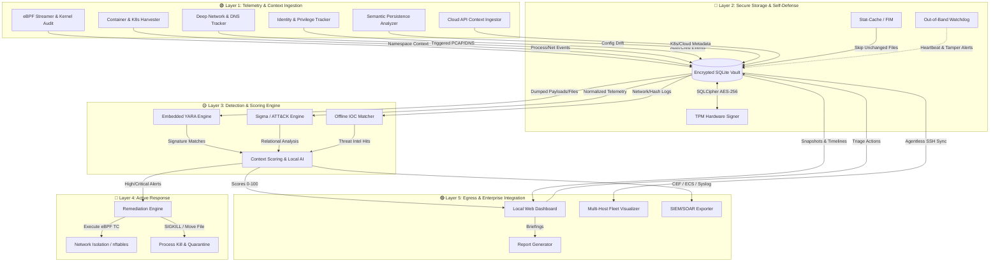

# Orin — Roadmap

Planned features and future engineering milestones for the Orin Forensic Engine. For implemented features, see [README.md](README.md).

### 🛡️ Phase 1: Trust, Survival & Core Architecture
*Before Orin can detect threats, it must ensure its own survival and guarantee the integrity of the data it collects.*

**1. Cryptographically Encrypted Evidence Vault** 🗓️
* **Description:** Ensure collected snapshot data, alerts, and dumped memory payloads are tamper-resistant from rootkits with high-privilege access.
* **Key Tasks:** Support SQLCipher/transparent AES-256 payload encryption; sign snapshot entries with hardware-backed keys (e.g., local TPM chips).

**2. Agent Self-Defense & Resilience** 🗓️
* **Description:** Protect the Orin agent from being killed, debugged, or modified by a compromised root user or advanced persistent threat (APT).
* **Key Tasks:** 
  * Implement an Out-of-Band Watchdog (a separate micro-service or secure systemd socket) to monitor the main Orin process and trigger critical "Agent Tampered" alerts if it dies.
  * Apply strict `seccomp` profiles and AppArmor/SELinux policies to restrict what the root user can do to Orin binaries, config files, and memory space.

---

### 👁️ Phase 2: Deep Kernel & System Visibility
*Establishing the foundational telemetry required to see what is happening at the lowest levels of the operating system.*

**3. Advanced Memory & Kernel Integrity Auditing** 🗓️
* **Description:** Detect advanced kernel rootkits, unlinked modules, and kernel-level symbol overrides.
* **Key Tasks:** Cross-reference `/proc/kallsyms` with standard kernel system maps; audit dynamic kernel patching in memory structures; implement heuristics for identifying unlinked LKMs hiding from `/proc/modules`.

**4. eBPF Ring-Buffer Real-Time Streamer** 🗓️
* **Description:** Augment point-in-time snapshots with a real-time event recorder using lightweight, zero-dependency eBPF kernel probes.
* **Key Tasks:** Deploy kprobes/tracepoints for `execve`, `tcp_connect`, and file opens; buffer events in a secure, local database queue for asynchronous threat engine analysis.

---

### 🧠 Phase 3: Identity, Context & Persistence
*Moving beyond "what happened" to "who did it" and "how are they staying on the system."*

**5. Identity, Access & Privilege Tracking** 🗓️
* **Description:** Track human and service identities, authentication events, and privilege boundary crossings.
* **Key Tasks:** 
  * Hook PAM (Pluggable Authentication Modules) to track logins, SSH sessions, and `sudo` transitions.
  * Use eBPF to monitor `setuid`, `setgid`, `capset` (capability changes), and `ptrace` (process injection/debugging) system calls.
  * Detect credential dumping by monitoring access to `/etc/shadow`, SSH agent memory, or Kerberos ticket caches.

**6. Semantic Persistence Analyzer** 🗓️
* **Description:** Understand the *intent* behind file changes by specifically monitoring locations used by malware to maintain persistence across reboots.
* **Key Tasks:** 
  * Parse and monitor high-value persistence vectors: Systemd service/timer files, crontabs, `udev` rules, and shell profiles (`~/.bashrc`).
  * Track SSH `authorized_keys` modifications.
  * Implement configuration drift detection (comparing active `sysctl` or `iptables` rules against a known-good baseline).

---

### 📦 Phase 4: Modern Environment Support
*Adapting Orin to understand the abstractions of modern infrastructure (containers and cloud).*

**7. Container & Namespace Forensic Harvester** 🗓️
* **Description:** Extend `/proc` mapping and socket collection to support containerized environments (Docker, Podman, Kubernetes).
* **Key Tasks:** Retrieve namespace context (`/proc/[pid]/ns/`) for network/mount/PID isolation; query local container runtime Unix sockets to map processes to container IDs/pod names; profile overlay filesystems for escape signals.

**8. Cloud & Orchestrator API Context** 🗓️
* **Description:** Correlate host-level telemetry with control-plane events to provide macro-level context for cloud and Kubernetes environments.
* **Key Tasks:** 
  * Ingest Kubernetes Audit Logs to correlate host eBPF events with control-plane events (e.g., a pod spawned with `privileged: true`).
  * Automatically pull Cloud Provider Metadata (AWS/GCP/Azure Instance ID, VPC, Security Groups, IAM roles) to enrich the forensic context of the compromised node.

---

### 🎯 Phase 5: Detection Engine & Threat Intel
*Applying rules, signatures, and external intelligence to the collected telemetry to find actual threats.*

**9. Embedded YARA Core Engine & FIM** 🗓️
* **Description:** Integrate a lightweight, offline YARA rules engine to execute pattern matching against files and dumped in-memory binaries.
* **Key Tasks:** Support `.yar` files from `/etc/orin/signatures/`; scan memory payloads from unlinked binaries; add FIM-accelerated scans (only run YARA against modified files).

**10. Offline Threat Intelligence & IOC Importer** 🗓️
* **Description:** Enable security teams to import offline threat intelligence feeds to screen target systems for known C2 infrastructure.
* **Key Tasks:** Ingest STIX/TAXII XML/JSON/CSV IOCs locally; match outbound network logs against offline blocklists; compare file metadata against lists of compromised cryptographic signatures.

**11. Deep Network Forensics & Triggered PCAP** 🗓️
* **Description:** Capture deep network payloads and DNS telemetry for active investigations without consuming massive amounts of disk space.
* **Key Tasks:** 
  * Track DNS queries/responses via eBPF uprobes on `libc`/`musl` to detect DNS tunneling or DGAs.
  * Implement a triggered PCAP ring-buffer that captures actual network payloads *only* when a specific YARA rule or IOC is triggered.

---

### ⚡ Phase 6: Response, Integration & Enterprise Scale
*Taking action on threats and integrating Orin into the broader enterprise security ecosystem.*

**12. Active Response & Automated Remediation** 🗓️
* **Description:** Transition Orin from a passive detector to an active defender capable of stopping attacks in real-time.
* **Key Tasks:** 
  * Safely terminate (`SIGKILL`) or suspend (`SIGSTOP`) malicious processes identified by the detection engine.
  * Dynamically inject rules into `nftables`/`iptables` or eBPF TC to block malicious IPs or isolate the host from the network.
  * Move confirmed malicious files to a secure, hashed quarantine directory.

**13. SIEM/SOAR Integration & Standardized Export** 🗓️
* **Description:** Ensure Orin telemetry can be seamlessly ingested by existing enterprise SOC tools (Splunk, Elastic, Sentinel).
* **Key Tasks:** 
  * Build native export pipelines for Kafka, Redis Pub/Sub, and Syslog.
  * Normalize all alerts and telemetry into standard formats like **CEF** (Common Event Format), **LEEF**, or **ECS** (Elastic Common Schema) for out-of-the-box SIEM parsing.

**14. Multi-Host Visualizer & Centralized Console** 🗓️
* **Description:** Extend the single-host console to support multi-node visual correlation, configuration distribution, and cluster-wide drift tracking.
* **Key Tasks:** Consolidate telemetry reports from multiple remote scan profiles into a single dashboard view; sync timelines of distinct systems to pinpoint lateral movement and coordinated credential abuse.

---

## System Architecture

