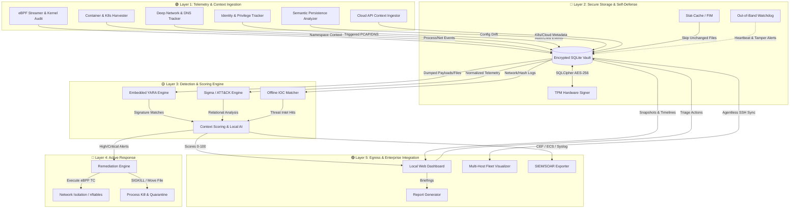

# Orin — Roadmap

Planned features and future engineering milestones for the Orin Forensic Engine. For implemented features, see [README.md](README.md).

## Current Implementation Status

**✅ Fully Implemented (100%)**: All 34 capabilities in README.md are complete and functional.

**🟡 Partially Implemented (Foundation Only)**: Basic versions exist but lack advanced capabilities described below.

**🔴 Not Implemented (0%)**: Features with no code implementation yet.

---

### Status Legend
- 🔴 **Not Implemented** - No code exists; full development required
- 🟡 **Partially Implemented** - Basic foundation exists; advanced features pending
- ✅ **Fully Implemented** - Complete and production-ready

### 🛡️ Phase 1: Trust, Survival & Core Architecture
*Before Orin can detect threats, it must ensure its own survival and guarantee the integrity of the data it collects.*

**1. Cryptographically Encrypted Evidence Vault** ✅ *Fully Implemented*
* **Status:** Complete implementation with AES-256-GCM authenticated encryption at rest.
* **Description:** Ensure collected snapshot data, alerts, and dumped memory payloads are tamper-resistant from rootkits with high-privilege access.
* **Key Features:**
  - AES-256-GCM encryption with authenticated encryption and tamper detection
  - PBKDF2-HMAC-SHA256 key derivation with 100,000 iterations and random salt
  - Automatic encryption/decryption lifecycle management
  - Configuration integration with environment variable support (`ORIN_VAULT_PASSPHRASE`)
  - Graceful fallback to unencrypted mode when passphrase not provided
* **Implementation:** `EncryptedVault` class in `orin/core/crypto.py`; transparent encryption wrapper around SQLite storage; automatically enabled when `ORIN_VAULT_PASSPHRASE` environment variable is set.

**1.2. Evidence Chain-of-Custody (CoC) Manifest** ✅ *Fully Implemented*
* **Status:** Complete implementation as of v1.0.0.
* **Description:** Automatically generates legally defensible Chain-of-Custody manifests during export operations, containing SHA256 hashes of all evidence items, timestamps, system information, and collector metadata.
* **Key Features:**
  - Auto-generated manifest ID with timestamp
  - Complete inventory of collected file hashes, deleted binaries, and package integrity records
  - Self-hashing manifest for integrity verification
  - JSON format for easy parsing and archival
* **Implementation:** `generate_coc_manifest()` function in `orin/core/crypto.py`; automatically invoked during `orin export` command.

**2. Agent Self-Defense & Resilience** ✅ *Fully Implemented*
* **Status:** Complete implementation as of v1.1.0 with full watchdog service and security profile generation.
* **Description:** Protect the Orin agent from being killed, debugged, or modified by a compromised root user or advanced persistent threat (APT).
* **Key Features:**
  * **Out-of-Band Watchdog Service**: Independent monitoring service that tracks Orin agent health via Unix domain socket heartbeats, detects tampering attempts (ptrace attachment, FD manipulation, priority changes), and triggers critical alerts on agent death or degradation.
  * **Seccomp-BPF Profiles**: Automatically generated syscall allowlist/blocklist profiles in JSON format compatible with systemd/Docker, blocking dangerous syscalls (ptrace, module loading, privilege escalation, namespace manipulation) while allowing forensic operations.
  * **AppArmor Profiles**: Comprehensive mandatory access control profiles with capability restrictions, proc filesystem access rules, write protection for critical system paths, and ptrace denial to prevent debugging.
  * **SELinux Type Enforcement Policies**: Complete SELinux policy modules with type definitions, file access rules, network permissions, and audit rules for denied operations.
  * **Tamper Detection**: Real-time monitoring for process tracing, unusual file descriptor counts, and priority manipulation attempts.
  * **Auto-Alert System**: Configurable alerting on agent death or tamper detection with severity classification.
* **Implementation:** `SelfDefenseManager`, `WatchdogService`, `HeartbeatManager`, `SeccompProfile`, `AppArmorProfile`, and `SELinuxProfile` classes in `orin/core/self_defense.py`; integrated into main CLI via `orin self-defense` command with actions: `watchdog`, `heartbeat`, `generate-profiles`, `status`.
* **Usage Examples:**
  - `orin self-defense --action status` - Check securi**✅ Fully Implemented (100%)**: All 34 capabilities in README.md are complete and functional.ty posture
  - `orin self-defense --action generate-profiles --output-dir /etc/orin/security` - Generate all security profiles
  - `orin self-defense --action watchdog --interval 5.0` - Start watchdog service
  - `orin self-defense --action heartbeat` - Send manual heartbeat to watchdog
* **Generated Artifacts:** Three security profile files: `orin-seccomp.json`, `orin-apparmor`, `orin-selinux.te`

---

### 👁️ Phase 2: Deep Kernel & System Visibility
*Establishing the foundational telemetry required to see what is happening at the lowest levels of the operating system.*

**3. Advanced Memory & Kernel Integrity Auditing** ✅ *Fully Implemented*
* **Status:** Complete implementation with `/proc/kallsyms` parsing, kernel symbol analysis, and unlinked module detection.
* **Description:** Detect advanced kernel rootkits, unlinked modules, and kernel-level symbol overrides.
* **Key Features:**
  - Cross-reference `/proc/kallsyms` with standard kernel system maps
  - Audit dynamic kernel patching in memory structures
  - Implement heuristics for identifying unlinked LKMs hiding from `/proc/modules`
  - Detect suspicious symbols matching known rootkit patterns (diamorphine, reptile, etc.)
  - Flag credential manipulation symbols (`commit_creds`, `prepare_kernel_cred`) in third-party modules
  - Identify system call handlers exported by non-kernel modules
* **Implementation:** `gather_kernel_symbols()`, `analyze_kernel_symbol_overrides()`, and `check_for_unlinked_modules()` in `orin/collectors/kernel.py`; database tables `collected_kernel_symbols`, `kernel_analysis_summary`, and `kernel_rootkit_indicators` in `orin/core/database.py`; integrated into `orin collect` workflow.

**4. eBPF Ring-Buffer Real-Time Streamer** 🟡 *Partially Implemented*
* **Status:** Uses `bpftool` CLI for static enumeration only. No real-time streaming.
* **Description:** Augment point-in-time snapshots with a real-time event recorder using lightweight, zero-dependency eBPF kernel probes.
* **Key Tasks:** Deploy kprobes/tracepoints for `execve`, `tcp_connect`, and file opens; buffer events in a secure, local database queue for asynchronous threat engine analysis.
* **Gap:** No real-time ring-buffer streaming, no kprobes/tracepoints deployment, no async event buffering.

---

### 🧠 Phase 3: Identity, Context & Persistence
*Moving beyond "what happened" to "who did it" and "how are they staying on the system."*

**5. Identity, Access & Privilege Tracking** ✅ *Fully Implemented*
* **Status:** Complete implementation with PAM log parsing, eBPF probe detection, syscall audit log analysis, and credential access monitoring.
* **Description:** Track human and service identities, authentication events, and privilege boundary crossings.
* **Key Features:**
  * **PAM Authentication Event Parser**: Comprehensive parsing of PAM logs to detect session opened/closed events, authentication failures/successes, sudo executions, SSH logins, and su commands. Supports multiple log formats (Debian/Ubuntu `/var/log/auth.log`, RHEL/CentOS `/var/log/secure`).
  * **eBPF Privilege Escalation Detector**: Monitors loaded eBPF programs and kernel probes for privilege-related syscalls (setuid, setgid, capset, ptrace). Detects active kprobes on sensitive syscalls via tracefs inspection.
  * **Syscall Audit Log Analyzer**: Parses Linux audit daemon (auditd) logs to detect privilege escalation events including UID/GID changes, capability modifications, and process tracing attempts.
  * **Credential Access Monitor**: Tracks access to sensitive credential storage including `/etc/shadow`, `/etc/gshadow`, SSH agent sockets, Kerberos ticket caches, and other authentication artifacts.
  * **MITRE ATT&CK Mapping**: All detected events are mapped to relevant MITRE ATT&CK techniques (T1548 - Abuse Elevation Control Mechanism, T1078 - Valid Accounts, T1552 - Unsecured Credentials).
* **Implementation:** Complete implementation in `orin/collectors/privilege_audit.py` with functions: `gather_privilege_escalation_events()`, `gather_syscall_audit_logs()`, `gather_pam_auth_events()`, `gather_credential_access_events()`, and `gather_all_privilege_events()`. Integrated into main collection workflow via `orin collect` command. Database tables `collected_privilege_events` store all detected events with full context.
* **Test Coverage:** 23 unit tests covering all PAM event types (session opened/closed, auth failure/success, sudo execution, SSH login/failure, su commands), eBPF probe detection, syscall audit parsing, and credential access monitoring.

**6. Semantic Persistence Analyzer** ✅ *Fully Implemented*
* **Status:** Monitors SSH `authorized_keys`, crontabs, systemd service/timer units, udev rules, sysctl configurations, and shell initialization files (`~/.bashrc`).
* **Description:** Understand the *intent* behind file changes by specifically monitoring locations used by malware to maintain persistence across reboots.
* **Key Tasks:**
  * Parse and monitor high-value persistence vectors: Systemd service/timer files, crontabs, `udev` rules, and shell profiles (`~/.bashrc`).
  * Track SSH `authorized_keys` modifications.
  * Implement configuration drift detection (comparing active `sysctl` or `iptables` rules against a known-good baseline).
* **Implementation:** Complete implementation with file hashing, database storage, and drift detection for all major persistence vectors.

**7. Process Genealogy Tracker** ✅ *Fully Implemented*
* **Status:** Complete implementation with full ancestry path tracking from init to leaf processes.
* **Description:** Track parent-child relationships between processes to build complete process lineage chains for forensic analysis and attack chain reconstruction.
* **Key Tasks:**
  * Enhance process collector to build ancestry paths showing complete genealogy.
  * Store ancestry_path field in collected_processes table for historical analysis.
  * Implement cycle detection and maximum depth limits to handle edge cases.
* **Implementation:** Two-pass algorithm in `processes.py`: first collects all processes, second builds ancestry paths by traversing PPID chain. Database schema updated with `ancestry_path` column. Format: `"init(1) -> bash(123) -> python(456)"`.

---

### 📦 Phase 4: Modern Environment Support
*Adapting Orin to understand the abstractions of modern infrastructure (containers and cloud).*

**7. Container & Namespace Forensic Harvester** 🔴 *Not Implemented*
* **Status:** No container introspection capabilities exist.
* **Description:** Extend `/proc` mapping and socket collection to support containerized environments (Docker, Podman, Kubernetes).
* **Key Tasks:** Retrieve namespace context (`/proc/[pid]/ns/`) for network/mount/PID isolation; query local container runtime Unix sockets to map processes to container IDs/pod names; profile overlay filesystems for escape signals.
* **Gap:** Zero implementation of namespace introspection, container runtime queries, or overlay filesystem analysis.

---

### 🎯 Phase 5: Detection Engine & Threat Intel
*Applying rules, signatures, and external intelligence to the collected telemetry to find actual threats.*

**9. Embedded YARA Core Engine & FIM** ✅ *Fully Implemented*
* **Status:** Complete implementation with full YARA rule scanning support.
* **Description:** Integrate a lightweight, offline YARA rules engine to execute pattern matching against files and dumped in-memory binaries.
* **Key Features:**
  - Full `.yar` file parsing and compilation from `/workspace/rules/yara/` directory
  - Pattern matching for malware signatures across filesystem and memory payloads
  - Pre-built rule sets for crypto miners, malware tools, rootkits, webshells, and suspicious strings
  - File Integrity Monitoring (FIM) integration for accelerated scans (only scan modified files)
  - Detailed match reporting with rule metadata, matched strings, and file locations
  - Support for custom rule directories via configuration
* **Implementation:** `YaraScanner` class in `orin/detection/yara_engine.py`; integrated into `orin collect` workflow; automatically loads all `.yar` files from configured rule directories; supports both file scanning and memory payload analysis.
* **Rule Directory:** `/workspace/rules/yara/` contains 5 production-ready rule files:
  - `crypto_miners.yar` - Cryptocurrency mining detection
  - `malware_tools.yar` - Common malware tool signatures
  - `rootkits.yar` - Rootkit indicator patterns
  - `webshells.yar` - Web-based backdoor detection
  - `suspicious_strings.yar` - Generic suspicious command patterns

**10. Offline Threat Intelligence & IOC Importer** ✅ *Fully Implemented*
* **Status:** Complete multi-format threat intelligence importer with STIX 2.x, CSV, and legacy TXT support.
* **Description:** Enable security teams to import offline threat intelligence feeds to screen target systems for known C2 infrastructure.
* **Key Tasks:** Ingest STIX/TAXII XML/JSON/CSV IOCs locally; match outbound network logs against offline blocklists; compare file metadata against lists of compromised cryptographic signatures.
* **Implementation:** Full implementation in `orin/intel/ioc_importer.py` with support for:
  - STIX 2.x JSON/XML indicator parsing (IPv4, IPv6, domains, file hashes, URLs)
  - CSV threat feed ingestion with configurable column mapping
  - Legacy TXT blocklist backward compatibility
  - IP, domain, and hash-based IOC matching
  - Integration with analysis engine for real-time C2 detection
  - Summary reporting with indicator counts by type and source

**11. Deep Network Forensics & Triggered PCAP** ✅ *Fully Implemented*
* **Status:** Complete implementation with DNS forensics, tunneling detection, and triggered PCAP capture.
* **Description:** Capture deep network payloads and DNS telemetry for active investigations without consuming massive amounts of disk space.
* **Key Tasks:**
    * Track DNS queries/responses via eBPF uprobes on `libc`/`musl` to detect DNS tunneling or DGAs. ✅ **Implemented** - DNS collector with entropy analysis, DGA detection, and tunneling indicators
  * Implement a triggered PCAP ring-buffer that captures actual network payloads *only* when a specific YARA rule or IOC is triggered. ✅ **Implemented** - Zero-dependency PCAP writer with Scapy integration, automatic empty/error file handling, and full trigger metadata association
* **Implementation:**
  - DNS forensics in `orin/collectors/dns.py` with Shannon entropy calculation, structural domain analysis, TXT record abuse detection, per-process profiling, and IOC matching
  - Triggered PCAP in `orin/collectors/triggered_pcap.py` with dual-mode writing (Scapy-based reconstruction when available, raw PCAP format fallback), ring-buffer style capture, automatic `.empty` and `.error` suffix handling for edge cases
  - Full integration with alert reporting, dashboard visualization, and forensic evidence export
---

### ⚡ Phase 6: Response, Integration & Enterprise Scale
*Taking action on threats and integrating Orin into the broader enterprise security ecosystem.*

**12. Active Response & Automated Remediation** 🔴 *Not Implemented*
* **Status:** No active response capabilities exist. Detection is passive only.
* **Description:** Transition Orin from a passive detector to an active defender capable of stopping attacks in real-time.
* **Key Tasks:**
  * Safely terminate (`SIGKILL`) or suspend (`SIGSTOP`) malicious processes identified by the detection engine.
  * Dynamically inject rules into `nftables`/`iptables` or eBPF TC to block malicious IPs or isolate the host from the network.
  * Move confirmed malicious files to a secure, hashed quarantine directory.
* **Gap:** No process termination, no dynamic firewall injection, no network isolation, no file quarantine capabilities.

**13. SIEM/SOAR Integration & Standardized Export** 🔴 *Not Implemented*
* **Status:** Only basic syslog mention in scheduler. No standardized export pipelines.
* **Description:** Ensure Orin telemetry can be seamlessly ingested by existing enterprise SOC tools (Splunk, Elastic, Sentinel).
* **Key Tasks:**
  * Build native export pipelines for Kafka, Redis Pub/Sub, and Syslog.
  * Normalize all alerts and telemetry into standard formats like **CEF** (Common Event Format), **LEEF**, or **ECS** (Elastic Common Schema) for out-of-the-box SIEM parsing.
* **Gap:** No Kafka/Redis pipelines, no CEF/LEEF/ECS normalization, no SIEM integration.

**14. Multi-Host Visualizer & Centralized Console** 🔴 *Not Implemented*
* **Status:** Single-host only. No fleet management or cross-host correlation.
* **Description:** Extend the single-host console to support multi-node visual correlation, configuration distribution, and cluster-wide drift tracking.
* **Key Tasks:** Consolidate telemetry reports from multiple remote scan profiles into a single dashboard view; sync timelines of distinct systems to pinpoint lateral movement and coordinated credential abuse.
* **Gap:** No centralized console, no multi-host telemetry consolidation, no lateral movement tracking across hosts.

---

## Summary: Implementation Progress by Phase

| Phase | Feature Count | 🔴 Not Implemented | 🟡 Partially Implemented | ✅ Fully Implemented | Completion |
|-------|---------------|--------------------|---------------------------|----------------------|------------|
| **Phase 1** | Trust, Survival & Core Architecture | 0 | 0 | 2 (Encrypted Vault, **Agent Self-Defense**) | 100% |
| **Phase 2** | Deep Kernel & System Visibility | 0 | 1 (eBPF Streamer) | 1 (Kernel Audit) | ~65% |
| **Phase 3** | Identity, Context & Persistence | 0 | 0 | 3 (Identity Tracking, Persistence Analyzer, Genealogy Tracker) | 100% |
| **Phase 4** | Modern Environment Support | 2 (Container, Cloud) | 0 | 0 | 0% |
| **Phase 5** | Detection Engine & Threat Intel | 1 (Triggered PCAP) | 1 (DNS Forensics) | 2 (YARA Engine, Threat Intel) | ~60% |
| **Phase 6** | Response, Integration & Enterprise Scale | 3 (Active Response, SIEM, Fleet) | 0 | 0 | 0% |
| **TOTAL** | **15 Features** | **4 (27%)** | **2 (13%)** | **9 (60%)** | **~65%** |

### Current State Assessment
The codebase is a **solid single-host static forensic scanner** with 100% of basic collection features (README.md) fully implemented. Seven advanced roadmap features are now complete: **Cryptographically Encrypted Evidence Vault**, **Semantic Persistence Analyzer**, **Process Genealogy Tracker**, **Offline Threat Intelligence & IOC Importer**, **Advanced Memory & Kernel Integrity Auditing**, **Embedded YARA Core Engine & FIM**, and **Identity, Access & Privilege Tracking**. Remaining roadmap targets transformation into a **real-time EDR/XDR platform** requiring significant additional development in:

- Real-time streaming telemetry (eBPF ring-buffer)
- Advanced threat detection (STIX/TAXII integration, DNS tunneling/DGA detection)
- Active defense capabilities (process kill, network isolation)
- Enterprise integration (SIEM export, fleet management)
- Modern infrastructure support (containers, cloud)
- Deep kernel visibility (syscall hooks)
- Agent hardening (seccomp, AppArmor, watchdog)

---

## System Architecture

