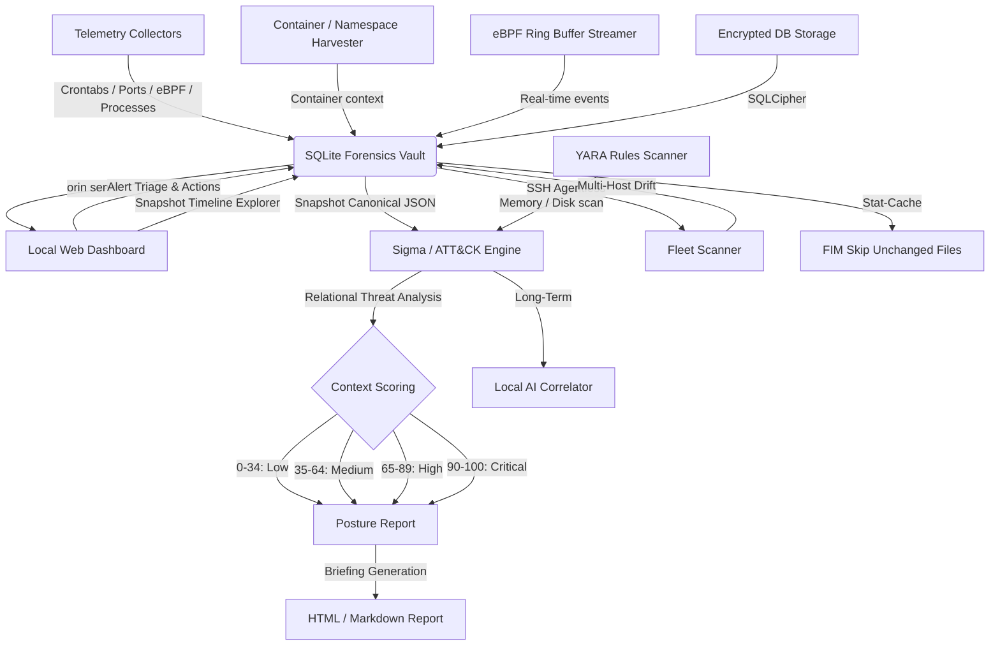

# Orin — Roadmap

Planned features and future engineering milestones for the Orin Forensic Engine. For implemented features, see [README.md](README.md).

> [!IMPORTANT]
> Orin operates strictly offline. No cloud services, no external APIs, no remote servers — ever.

> **Status key:** ✅ Completed &nbsp;|&nbsp; 🔄 In Progress &nbsp;|&nbsp; 🗓️ Planned

---

## Future Milestones

### 1. Container & Namespace Forensic Harvester (Milestone 6) 🗓️
* **Description:** Extend `/proc` mapping and socket collection to support containerized environments (Docker, Podman, Kubernetes).
* **Key Tasks:**
  - Retrieve namespace context (`/proc/[pid]/ns/`) for network, mount, and PID isolation.
  - Query local container runtime Unix sockets (offline) to correlate process mappings with container IDs and pod names.
  - Profile container-specific namespaces for overlay filesystem modifications and container escape signals.

### 2. Embedded YARA Core Engine (Milestone 7) 🗓️
* **Description:** Integrate a lightweight, offline YARA rules engine to execute pattern matching against files on disk and dumped in-memory binaries.
* **Key Tasks:**
  - Support loading of compiled or plaintext `.yar` files from a dedicated local directory `/etc/orin/signatures/`.
  - Scan memory payloads dumped from unlinked running binaries (anti-forensics recovery vault).
  - Add FIM-accelerated scans: only run YARA rules against files flagged as modified.

### 3. Advanced Memory & Kernel Integrity Auditing (Milestone 8) 🗓️
* **Description:** Detect advanced kernel rootkits and kernel-level symbol overrides.
* **Key Tasks:**
  - Cross-reference system calls and kernel exports in `/proc/kallsyms` with standard kernel system map files.
  - Audit dynamic kernel patching signs or modifications in memory structures.
  - Implement heuristics for identifying unlinked kernel modules (LKMs) hiding from `/proc/modules`.

### 4. Offline Threat Intelligence & IOC Feed Importer (Milestone 9) 🗓️
* **Description:** Enable security teams to import offline threat intelligence feeds to screen target systems for known C2 infrastructure or files.
* **Key Tasks:**
  - Ingest STIX/TAXII XML, JSON, or CSV indicators of compromise (IOCs) locally.
  - Match outbound network logs against offline blocklists of domains and IP subnets.
  - Compare file integrity metadata against lists of compromised cryptographic file signatures.

### 5. eBPF Ring-Buffer Real-Time Streamer (Milestone 10) 🗓️
* **Description:** Augment point-in-time snapshot collection with a real-time event recorder using lightweight eBPF kernel probes.
* **Key Tasks:**
  - Deploy standard kprobes/tracepoints for process spawning (`execve`), connection building (`tcp_connect`), and file open operations.
  - Buffer events in a secure, local database queue for asynchronous threat engine analysis.
  - Act as a lightweight, zero-dependency alternative to `auditd` or `Sysmon for Linux`.

### 6. Cryptographically Encrypted Evidence Vault (Milestone 11) 🗓️
* **Description:** Ensure collected snapshot data, alerts, and dumped memory payloads are tamper-resistant from rootkits with high-privilege access.
* **Key Tasks:**
  - Support database encryption via SQLCipher or transparent AES-256 payload encryption.
  - Sign snapshot entries with hardware-backed keys (e.g. local TPM chips) when available.

### 7. Multi-Host Visualizer & Centralized Console (Milestone 12) 🗓️
* **Description:** Extend the single-host console to support multi-node visual correlation, configuration distribution, and cluster-wide drift tracking.
* **Key Tasks:**
  - Consolidate telemetry reports from multiple remote scan profiles into a single dashboard view.
  - Sync timelines of distinct systems to pinpoint lateral movement and coordinated credential abuse.

---

## System Architecture

