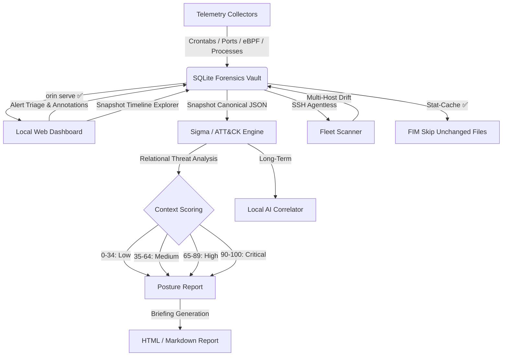

# Orin — Roadmap

Planned features for the Orin Forensic Engine. For what's already built, see [README.md](README.md).

> [!IMPORTANT]
> Orin operates strictly offline. No cloud services, no external APIs, no remote servers — ever.

> **Status key:** 🔄 In Progress &nbsp;|&nbsp; 🗓️ Planned

---

### 🗓️ 1. MITRE ATT&CK Tactic Tagging
> **Priority: High — low effort, high value.**

Map every alert to its corresponding ATT&CK technique ID and tactic. Embed a bundled offline lookup table — no network calls. Each `security_events` record gets `attck_technique` (e.g. `T1014`), `attck_tactic` (e.g. `Defense Evasion`), and `attck_url` fields. Reports render clickable technique badges.

No new dependencies. Pure data enrichment.

---

### 🗓️ 2. Agentless SSH Fleet Scanner
> **Priority: High — strongest path to enterprise use.**

Profile remote Linux hosts over SSH without installing anything on the target. The controller queries system state (ports, users, kernel modules, file hashes), pulls the metadata locally, and runs drift analysis against stored baselines.

Sub-features:
- **SUID/SGID Binary Monitor** — walk the filesystem, baseline setuid binaries, alert on new ones between snapshots. Low effort, high signal.
- **Fleet Web Console** — aggregate risk scores from all remote hosts into a single color-coded dashboard once the SSH scanner is live.

---

### 🗓️ 3. Context-Aware Risk Scoring
> **Priority: Medium-High — reduces false positives.**

Current risk scoring is per-alert. This pillar makes it relational: a loose `sudoers` rule stays medium severity unless it's paired with disabled `auditd` and an active anomalous process — then it escalates to critical.

Also includes:
- **Baseline Manager** (`orin baseline add --user`, `orin baseline add --module`, `orin baseline refresh`) — update trusted baselines after package upgrades without losing historical snapshot data.

---

### 🗓️ 4. Sigma Rules Support
> **Priority: Medium — community multiplier.**

A compile-free, zero-dependency Sigma rule evaluator that scans `/var/log/auth.log` and journald records, flagging ATT&CK patterns with timestamps. Detection engineers worldwide can contribute rules immediately.

Also includes lateral movement enrichment: parse `sudo` and `su` logs, alert on sensitive targets (`bash`, `python`, `find`, `vim`) executed via privilege escalation.

---

### 🗓️ 5. eBPF Rootkit Auditing
> **Priority: Medium — targets the most advanced attack class on Linux.**

eBPF-based rootkits (Pamspy, TripleCross, ebpfkit) are invisible to LKM and FIM scanners. This pillar adds:

- **eBPF Subsystem Auditor** — enumerate loaded BPF programs, track pinned objects under `/sys/fs/bpf`, detect linker preload overrides, alert on `bpftool` policy rewrites.
- **Open File Descriptor Harvester** — walk `/proc/[pid]/fd/`, flag `memfd:` anonymous descriptors and hidden Unix socket streams.

---

### 🗓️ 6. Local AI Triage & Multi-Host Correlation
> **Priority: Long-term — highest effort, most speculative.**

> [!NOTE]
> This is the only pillar that introduces optional heavy dependencies (ONNX or Ollama). Strictly opt-in via `pip install orin[ai]`. The core engine stays lean.

Feed signed snapshot exports from multiple hosts through a locally-running model to map lateral movement, identify shared IoCs, and produce a unified multi-host incident brief. Everything stays on the analyst's machine.

---

## Implementation Flow

