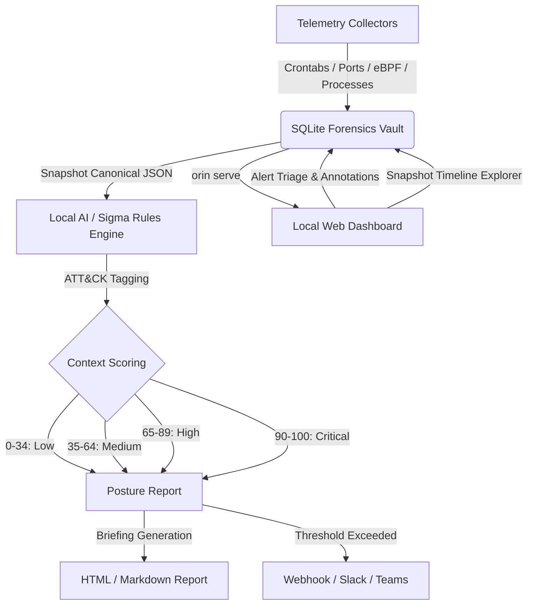

# Orin — Forensic & Threat Detection Roadmap

This document outlines the **next-generation capabilities** planned for the Orin Forensic Engine. For a full list of everything already implemented, see [README.md](README.md).

> [!IMPORTANT]
> **Orin operates strictly offline and locally.** The engine does not connect to any cloud services, external APIs, or remote servers. All telemetry collection, signature matching, and timeline analysis run entirely on the local system to guarantee absolute privacy and integrity of forensic evidence.

---

## 🔭 Next-Generation Capabilities & Future Features

To solve major gaps in the Linux forensics industry while maintaining a strict offline boundary, our upcoming feature pipeline is organized into seven strategic pillars:

### 1. Secure, Local AI Triage & Multi-Host Correlation

Analyzing raw forensic evidence using external servers or SaaS platforms introduces massive privacy and compliance risks. Orin will introduce local, secure multi-host correlation.

* **Planned Feature: Local AI Timeline Correlator (`orin.analysis.ai_correlator`)**
  * **Objective:** Correlate signed JSON snapshot exports from multiple systems (e.g., a developer workstation, an application server, and a database) on the analyst's machine.
  * **Implementation:** Feed consolidated timelines through a local, context-optimized model (running locally on the workstation via ONNX or Ollama). The engine will automatically map lateral movement, identify shared Indicators of Compromise (IoCs), and output a unified multi-host incident brief.
* **Planned Feature: Cross-Snapshot Drift Reports (`orin report --diff`)**
  * **Objective:** Allow analysts to run comparative differentials between snapshots locally.
  * **Implementation:** CLI parameters `orin report --format html --base <id1> --target <id2>` will build a self-contained offline comparison dashboard highlighting additions, modifications, and removals of processes, ports, files, and users.

### 2. Forensic Auditing for eBPF-Based Rootkits

Stealthy eBPF-based rootkits (such as LinkPro, TripleCross, and ebpfkit) run sandboxed inside the kernel's virtual machine, making them completely invisible to traditional LKM and file integrity scanners.

* **Planned Feature: eBPF Subsystem Auditor (`orin.collectors.ebpf`)**
  * **Objective:** Audit the state of the local eBPF subsystem to expose malicious filters and rootkits.
  * **Implementation:** Enumerate loaded BPF programs, track pinned objects under `/sys/fs/bpf`, detect dynamic linker preload overrides, and raise alerts when administrative tools like `bpftool` are used to rewrite policy maps or detach security filters.
* **Planned Feature: Open File Descriptor Harvester (`orin.collectors.file_descriptors`)**
  * **Objective:** Audit open process descriptors to expose fileless malware.
  * **Implementation:** Walk `/proc/[pid]/fd/` and flag anonymous memory-backed file descriptors (`memfd:`) and unexpected hidden Unix socket streams.

### 3. Lightweight Linux Log Triage via Sigma Rules

Linux log auditing (`syslog`, `auditd`, `journald`) lacks a lightweight, standardized local scanner equivalent to Windows-centric log-parsing standards.

* **Planned Feature: Sigma Log Parser & Rules Matcher (`orin.analysis.sigma`)**
  * **Objective:** Ingest standardized Sigma rules to triage Linux log files directly on the compromised host.
  * **Implementation:** Implement a compile-free, zero-dependency Sigma rule evaluator that scans `/var/log/auth.log` and raw journald records, instantly flagging MITRE ATT&CK patterns with precise timestamps.
* **Planned Feature: Auth Log Lateral Movement Enrichment (`orin.collectors.logs`)**
  * **Objective:** Extend log parsing to identify lateral movement techniques.
  * **Implementation:** Harvest and parse `sudo` command logs and `su` session switches from system logs, alerting on sensitive execution targets (`bash`, `python`, `find`, `vim`) run via sudo.

### 4. Agentless Drift Detection for Diverse Linux Fleets

Installing intrusive kernel agents on legacy systems, operational technology (OT) appliances, and resource-constrained embedded nodes introduces severe stability and performance risks.

* **Planned Feature: Remote SSH Agentless Scanner (`orin.remote.profiler`)**
  * **Objective:** Profile and monitor diverse Linux fleets without installing any runtime code on target endpoints.
  * **Implementation:** Deploy a controller script that connects to remote targets over SSH, queries system state (active ports, users, kernel modules, file hashes), pulls the metadata, and runs drift analysis against local baselines.
* **Planned Feature: SUID/SGID Binary Monitor (`orin.collectors.suid`)**
  * **Objective:** Scan and detect newly introduced SUID/SGID binaries on the system.
  * **Implementation:** Walk the filesystem, index binaries with SUID/SGID bits set, and alert if new setuid files appear between snapshots.

### 5. Relational and Temporal Compliance Risk Scoring

Traditional compliance checkers evaluate configuration check-lists in isolation, leading to high false-positive rates.

* **Planned Feature: Context-Aware Compliance Risk Engine (`orin.analysis.context_scorer`)**
  * **Objective:** Transition risk calculations from simple checklists to an interconnected network of events.
  * **Implementation:** Escalate risk scores based on relational threat patterns. For example, a loosely configured `sudoers` rule on a host will escalate to critical severity only if paired with disabled auditing (`auditd`) or active anomalous system process events.
* **Planned Feature: In-Place Baseline Manager (`orin baseline refresh`)**
  * **Objective:** Support baseline evolution without losing historical snapshot data.
  * **Implementation:** Support adding individual users (`orin baseline add --user <username>`) or kernel modules (`orin baseline add --module <name>`) to the trusted ledger, and implement `orin baseline refresh` to synchronize the baseline database after package upgrades.

### 6. Ecosystem Integrations & Live Alerting

Orin's forensic findings are only as useful as the systems that act on them. This pillar focuses on making Orin's output richer and more actionable — without exporting data to any external platform.

> [!NOTE]
> Orin does not push data to any third-party platform. All features in this pillar are **local and opt-in**. Offline-only mode remains the default and is never compromised.

* **Planned Feature: MITRE ATT&CK Tactic Tagging (`orin.analysis.attck`)**
  * **Objective:** Map every generated alert to its corresponding MITRE ATT&CK technique ID and tactic, making Orin's output immediately readable by SOC analysts and compliance auditors.
  * **Implementation:** Embed a bundled, offline ATT&CK technique lookup table. Each `security_events` record will carry `attck_technique` (e.g. `T1014`), `attck_tactic` (e.g. `Defense Evasion`), and `attck_url` fields. Reports and HTML dashboards will render clickable technique badges.
  * **Effort:** Low — no new dependencies. Pure data enrichment of existing alert records.

* **Planned Feature: Webhook & Notification Alerting (`orin.notify`)**
  * **Objective:** Push critical and high-severity findings to existing communication and incident channels the moment `orin analyze` runs, turning Orin from a manual forensics tool into a live detection system.
  * **Implementation:** A configurable notifier supporting Slack (incoming webhooks), Microsoft Teams (adaptive cards), and generic HTTP webhooks (JSON POST). Triggered automatically post-analysis when findings meet a configured severity threshold. All endpoints are defined in `orin_config.json` and no network calls are made by default.
  * **Effort:** Low — pure Python `http.client`, zero new dependencies.

### 7. Local Web Interface

Orin's CLI is powerful for scripted workflows and forensic analysts, but a local web interface unlocks a broader audience: system administrators, security managers, and teams without deep terminal experience. All data stays on the local machine — the web server binds only to `localhost` by default.

> [!NOTE]
> `orin serve` starts a local-only HTTP server bound to `127.0.0.1`. No data leaves the machine. TLS and optional basic-auth are available for multi-user environments.

* **Planned Feature: Live Risk Dashboard (`orin serve`)**
  * **Objective:** Replace static HTML reports with a live, auto-refreshing local web dashboard that surfaces the current system risk posture at a glance.
  * **Implementation:** A lightweight Python HTTP server (stdlib `http.server`) serves a single-page dashboard reading directly from the SQLite vault. Displays: live risk score gauge, severity-tiered alert feed, snapshot history timeline, collector status cards (last run, record count), and FIM change heatmap. Auto-refreshes every 30 seconds without page reload via `fetch` polling. Zero external JS dependencies — all assets are bundled inline.
  * **Effort:** Medium.

* **Planned Feature: Interactive Alert Manager**
  * **Objective:** Allow analysts to triage, acknowledge, and annotate alerts directly from the browser without touching the CLI.
  * **Implementation:** Each alert card in the dashboard will support: one-click acknowledge (marks event as reviewed with timestamp), analyst notes (free-text annotation stored in the vault), false-positive suppression (creates a suppression rule for future occurrences), and severity override. All actions write directly to the local SQLite `security_events` table.
  * **Effort:** Medium.

* **Planned Feature: Snapshot Timeline Explorer**
  * **Objective:** Provide an interactive visual timeline of all collected snapshots, enabling drag-to-compare delta analysis without CLI commands.
  * **Implementation:** A scrollable, zoomable timeline rendered with vanilla JS (no frameworks). Clicking a snapshot shows its collector summary cards. Selecting two snapshots triggers an inline diff view equivalent to `orin delta`, highlighting process, port, file, user, and module changes between them.
  * **Effort:** Medium-High.

* **Planned Feature: Configuration Editor**
  * **Objective:** Expose `orin_config.json` settings and baseline management through a structured form UI, eliminating manual JSON editing.
  * **Implementation:** A settings page with field-validated forms for: expected ports list, whitelisted processes, FIM critical paths and directories, notification webhook URLs, and severity thresholds. Changes are written back to `orin_config.json` atomically. Baseline management surfaces `orin baseline add / refresh` as button actions.
  * **Effort:** Low-Medium.

* **Planned Feature: Fleet Overview (requires Pillar 4)**
  * **Objective:** When the SSH agentless scanner is active, aggregate posture data from all monitored hosts into a single fleet health view.
  * **Implementation:** A fleet page listing each registered host with its last-seen timestamp, current risk score, and unresolved alert count. Clicking a host drills into its individual dashboard view. Risk scores are colour-coded (green / amber / red) for at-a-glance triage. Requires the Remote SSH Agentless Scanner from Pillar 4.
  * **Effort:** Medium (depends on Pillar 4).

---

## 🧪 Implementation Flow Matrix

