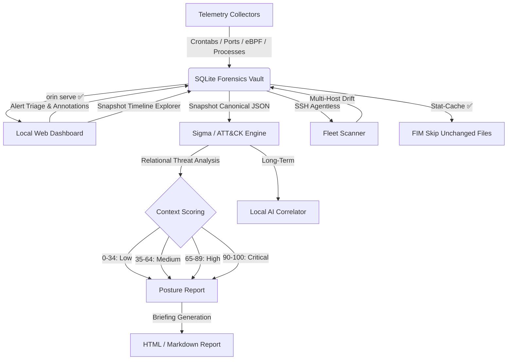

# Orin — Roadmap

Planned features for the Orin Forensic Engine. For what's already built, see [README.md](README.md).

> [!IMPORTANT]
> Orin operates strictly offline. No cloud services, no external APIs, no remote servers — ever.

> **Status key:** ✅ Completed &nbsp;|&nbsp; 🔄 In Progress &nbsp;|&nbsp; 🗓️ Planned

---

All planned milestones have been completed.

---

## Implementation Flow

