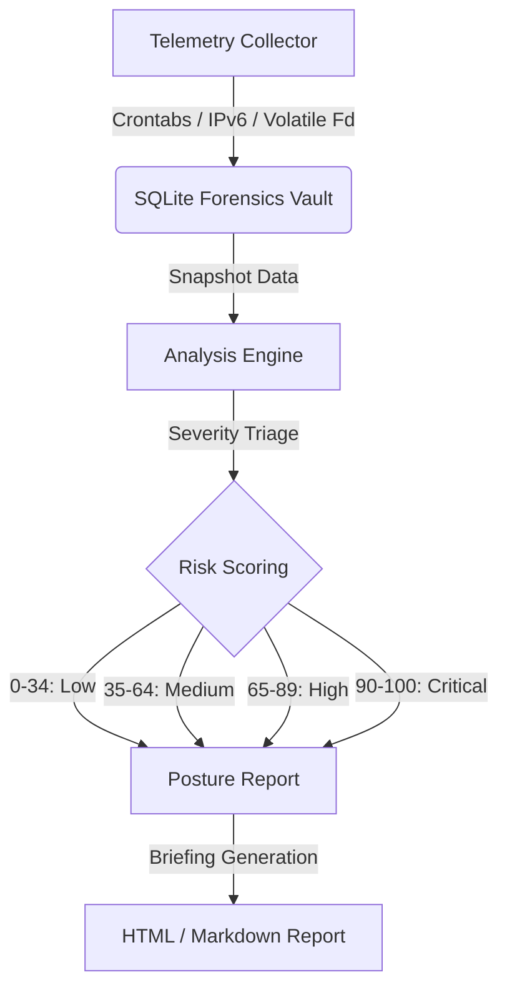

# Orin — Forensic Engine Roadmap

This document outlines the planned updates, upgrades, and upcoming feature enhancements for the Orin offline forensic engine.

---

## 📅 Planned Upgrades & New Features

### 1. Per-User Crontab Persistence Harvester (`orin.collectors.crontabs`)
*   **Problem:** Malware frequently registers cron jobs to maintain persistence, but individual user crontabs under `/var/spool/cron/crontabs/` are not currently harvested.
*   **Solution:** Create a crontab harvester that:
    *   Reads per-user crontabs as well as `/etc/crontab` and `/etc/cron.*` directories.
    *   Saves cron commands and schedules to the vault.
    *   Compares them against baselines to flag unauthorized additions.

### 2. Zero-Dependency Threat Signature Scanner (`orin.analysis.signatures`)
*   **Problem:** Forensics often requires matching known malicious patterns, but installing external dependencies (like YARA bindings) violates Orin's zero-dependency runtime guarantee.
*   **Solution:** Implement a pure-Python, lightweight signature matching engine:
    *   Support JSON-defined rules detailing regex and string patterns.
    *   Scan process environment variables, execution arguments, and FIM target files.
    *   Deduplicate and raise security events with `"suspicious_signature"` severity.

### 3. Background Daemon Mode (`orin watch`)
*   **Problem:** Orin currently runs on-demand, which can allow transient indicators of compromise to be missed.
*   **Solution:** Build a background daemonizing subcommand:
    *   `orin watch --interval <minutes>` runs the collection and analysis loop continuously.
    *   Output alerts to local syslog (`/dev/log`) or write to structured JSON lines in `/var/log/orin/alerts.json` for forwarding.

### 4. Diff & Timeline Reports (`orin report --diff`)
*   **Problem:** Reports currently only reflect the state of a single snapshot. Incident response investigations require clear drift reports over time.
*   **Solution:** Extend the reporter module to support:
    *   `orin report --format html --base <id1> --target <id2>`
    *   Generates a styled offline dashboard highlighting added/removed/modified processes, ports, files, and users.

### 5. In-Place Baseline Management (`orin baseline refresh`)
*   **Problem:** System updates (kernel upgrades or package installations) add new LKMs or system users, forcing the analyst to clear the database to update baselines.
*   **Solution:** Create a baseline manager CLI:
    *   `orin baseline add --user <username>` or `orin baseline add --module <name>`
    *   `orin baseline refresh` to synchronize the trusted baseline with the current system state, leaving historical snapshots intact.

### 6. File Integrity Monitoring (FIM) Performance Tuning
*   **Problem:** Computing SHA-256 hashes for all critical system files on every run can become resource-heavy on slow disks.
*   **Solution:** Introduce metadata-based pre-filtering:
    *   Store file metadata (mtime, size, inode) in the SQLite database.
    *   Skip hashing if the metadata hasn't changed. Only compute SHA-256 for files with modified metadata.

---

## 🔭 Future Feature Gaps

### 7. Open File Descriptor Harvester (`orin.collectors.file_descriptors`)
*   **Problem:** Malware using `memfd_create` or hidden Unix sockets leaves no trace on disk, but its open file descriptors are visible under `/proc/[pid]/fd/`. This vector is currently unmonitored.
*   **Solution:** Add an FD harvester that:
    *   Resolves symlinks under `/proc/[pid]/fd/` for each running process.
    *   Flags anonymous memory-backed file descriptors (`memfd:`) and unexpected socket descriptors.
    *   Correlates findings with the process tree to surface the owning process.

### 8. `/etc/ld.so.preload` Integrity Monitor (`orin.collectors.integrity`)
*   **Problem:** `/etc/ld.so.preload` is a classic rootkit persistence mechanism — a malicious shared library listed here is injected into every process at startup. It is not currently covered by the FIM.
*   **Solution:** Extend the FIM critical paths to explicitly track `/etc/ld.so.preload`:
    *   Alert on any modification or creation of this file between snapshots.
    *   Parse and record each listed library path as a separate vault entry.
    *   Raise a `Critical` severity event if any entry is not present in the baseline.

### 9. Systemd Unit File Collector (`orin.collectors.systemd`)
*   **Problem:** Malware frequently drops `.service` or `.timer` unit files to survive reboots. The FIM watches `/etc/systemd/system` at the file level, but there is no dedicated collector that parses and surfaces new or modified unit definitions explicitly.
*   **Solution:** Build a systemd unit harvester that:
    *   Enumerates all `.service`, `.timer`, `.socket`, and `.path` unit files in `/etc/systemd/system/` and `/lib/systemd/system/`.
    *   Extracts `ExecStart`, `User`, and `WantedBy` directives into the vault.
    *   Flags units that are new since the last snapshot or whose `ExecStart` binary resolves to a volatile directory.

### 10. SUID/SGID Binary Scanner (`orin.collectors.suid`)
*   **Problem:** Privilege-escalation techniques frequently rely on new or tampered setuid/setgid binaries introduced after the baseline is captured. No collector currently enumerates the full SUID/SGID surface.
*   **Solution:** Implement a setuid scanner that:
    *   Walks the filesystem (configurable root paths) and records all binaries with the SUID or SGID bit set, their owning user/group, and SHA-256 hash.
    *   Compares against the baseline to detect newly added or modified setuid binaries.
    *   Raises a `High` severity event for any binary not present in the trusted baseline.

### 11. Auth Log Enrichment — `sudo` & `su` Auditing (`orin.collectors.logs`)
*   **Problem:** The current auth log parser surfaces SSH brute-force IPs and privilege changes at a coarse level. Lateral movement and insider-threat scenarios are often revealed by `sudo` command invocations and `su` session switches, which are not yet extracted.
*   **Solution:** Extend the log parser to:
    *   Extract individual `sudo` commands (user, command, working directory, timestamp) from `auth.log` / `journal`.
    *   Record `su` session open/close events with source and target users.
    *   Flag `sudo` invocations of sensitive binaries (`bash`, `python`, `perl`, `awk`, `find`, `vim`) as `Medium` severity events.

---

## 🧪 Implementation Flow Matrix

